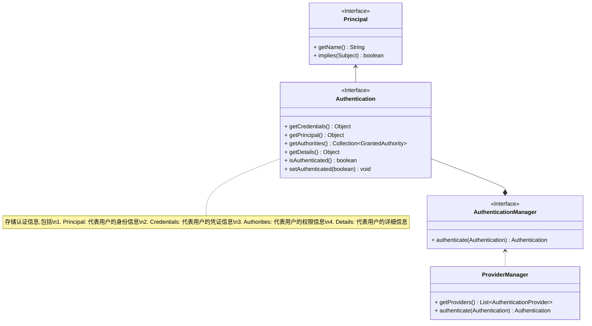
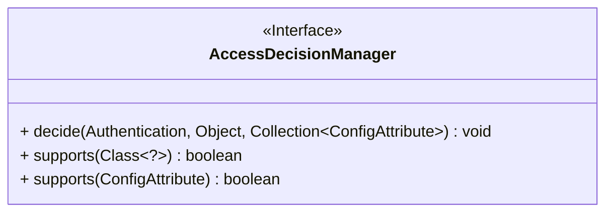

`Spring Security`是一个强大且高度可定制的认证和访问控制框架,它为基于`Spring`的应用程序提供了全面的安全服务

## 主要功能

### 认证(Authentication)

**认证是指对资源采取保护措施的过程,至于是否需要采取这一措施大部分情况下取决于资源的价值**

:::tip

认证在日常生活中随处可见,比如去电影院看电影要买票,买票这个过程就是认证的过程

:::

`Spring Security`中和`认证`相关的核心接口和类如下图:



### 授权(Authorization)

**授权是指已经通过认证的用户是否有权限执行特定操作.它是认证的延伸,用于实现细粒度的访问控制**

`Spring Security`中和`授权`相关的核心接口和类如下图:



## 工作方式

**`Spring Security`通过一系列的`Servlet`过滤器来保护Web请求.**

这些过滤器负责不同的安全功能,例如检查用户是否已经登录、检查用户是否有权执行特定操作等.

下面这张表列出了`Spring Security`中几个主要的过滤器及其作用:

| 过滤器                                                                                                                                                                                              | 简介                                                                 |
|--------------------------------------------------------------------------------------------------------------------------------------------------------------------------------------------------|--------------------------------------------------------------------|
| [UsernamePasswordAuthenticationFilter](https://docs.spring.io/spring-security/site/docs/current/api/org/springframework/security/web/authentication/UsernamePasswordAuthenticationFilter.html)   | 用于处理基于表单的登录请求.它会拦截/login请求并尝试进行认证                                  |
| [BasicAuthenticationFilter](https://docs.spring.io/spring-security/site/docs/current/api/org/springframework/security/web/authentication/www/BasicAuthenticationFilter.html)                     | 用于处理HTTP基本认证                                                       |
| [RememberMeAuthenticationFilter](https://docs.spring.io/spring-security/site/docs/current/api/org/springframework/security/web/authentication/rememberme/RememberMeAuthenticationFilter.html)    | 用于处理"记住我"认证请求                                                      |
| [LogoutFilter](https://docs.spring.io/spring-security/site/docs/current/api/org/springframework/security/web/authentication/logout/LogoutFilter.html)                                            | 用于处理用户的登出请求                                                        |
| [CsrfFilter](https://docs.spring.io/spring-security/site/docs/current/api/org/springframework/security/web/csrf/CsrfFilter.html)                                                                 | 用于处理跨站请求伪造                                                         |
| [ExceptionTranslationFilter](https://docs.spring.io/spring-security/site/docs/current/api/org/springframework/security/web/access/ExceptionTranslationFilter.html)                               | 用于处理认证过程中抛出的异常                                                     |
| [FilterSecurityInterceptor](https://docs.spring.io/spring-security/site/docs/current/api/org/springframework/security/web/access/intercept/FilterSecurityInterceptor.html)                       | 用于在过滤器链结束前检查访问资源的权限                                                |
| [AnonymousAuthenticationFilter](https://docs.spring.io/spring-security/site/docs/current/api/org/springframework/security/web/authentication/AnonymousAuthenticationFilter.html)                 | 为没有提供凭证的请求提供一个匿名Authentication,通常用于允许匿名用户访问某些资源                    |
| [SessionManagementFilter](https://docs.spring.io/spring-security/site/docs/current/api/org/springframework/security/web/session/SessionManagementFilter.html)                                    | 用于处理会话管理                                                           |
| [ConcurrentSessionFilter](https://docs.spring.io/spring-security/site/docs/current/api/org/springframework/security/web/session/ConcurrentSessionFilter.html)                                    | 用于处理并发会话控制                                                         |
| [RequestCacheAwareFilter](https://docs.spring.io/spring-security/site/docs/current/api/org/springframework/security/web/savedrequest/RequestCacheAwareFilter.html)                               | 用于处理请求缓存                                                           |
| [SecurityContextHolderAwareRequestFilter](https://docs.spring.io/spring-security/site/docs/current/api/org/springframework/security/web/servletapi/SecurityContextHolderAwareRequestFilter.html) | 用于处理SecurityContextHolder中的SecurityContext与HttpServletRequest之间的交互 |
| [TokenAuthenticationFilter](https://docs.spring.io/spring-security/site/docs/current/api/org/springframework/security/web/authentication/preauth/AbstractPreAuthenticatedProcessingFilter.html)  | 用于处理基于Token的认证请求,并将认证结果封装成Authentication对象                         |

上面这些过滤器组成了`Spring Security`的[过滤器链-SecurityFilterChain](https://docs.spring.io/spring-security/site/docs/current/api/org/springframework/security/web/SecurityFilterChain.html),它会在合适的时机依次调用过滤器链中的过滤器来实现对Web请求的保护.

:::tip

关于`Spring Security架构`的更多信息,可能参考这里:[Spring Security Architecture](https://docs.spring.io/spring-security/reference/servlet/architecture.html)
:::

## 安装

::: code-tabs#安装springboot-security

@tab:active maven

```xml

<dependency>
    <groupId>org.springframework.boot</groupId>
    <artifactId>spring-boot-starter-security</artifactId>
    <version>3.1.4</version>
</dependency>

```

@tab gradle-kts

```bash
// https://mvnrepository.com/artifact/org.springframework.boot/spring-boot-starter-security
implementation("org.springframework.boot:spring-boot-starter-security:3.1.4")
```

:::

## 配置

大部分情况下我们都需要自定义`Spring Security`的配置以适应我们的业务需求.

[工作方式](#工作方式)这里提到了`Spring Security`使用一系列的`Servlet`过滤器来保护Web请求,这些过滤器组成了`Spring Security`的[过滤器链-SecurityFilterChain](https://docs.spring.io/spring-security/site/docs/current/api/org/springframework/security/web/SecurityFilterChain.html)

**所以我们对`Spring Security`进行定制化配置实际上就是修改这个过滤器链.**

```kotlin
@EnableWebSecurity
class SecurityConfig {

    @Bean
    @Throws(Exception::class)
    fun filterChain(http: HttpSecurity): SecurityFilterChain {
        http.authorizeHttpRequests {
            it.anyRequest().authenticated()
        }
        http.csrf {
            it.disable()
        }
        return http.build()
    }
}
```

:::tip
1. [@EnableWebSecurity](https://docs.spring.io/spring-security/site/docs/current/api/org/springframework/security/config/annotation/web/configuration/EnableWebSecurity.html)
   通常和@Configuration一起用于自定义安全配置
2. 如果不添加[@EnableWebSecurity](https://docs.spring.io/spring-security/site/docs/current/api/org/springframework/security/config/annotation/web/configuration/EnableWebSecurity.html)这个注解,`SpringSecurity`的默认配置会生效,导致所有未经认证的请求被重定向到`/login`页面
:::

## 参考

* [Introduction to Spring Method Security | Baeldung](https://www.baeldung.com/spring-security-method-security)
* [spring security中的核心概念及组件](https://poe.com/s/pFij7ngb1cSUQgk5N7TD)
