<script setup lang="ts">
const images = [{src:'https://cdn.jsdelivr.net/gh/hhypygy/images@master/20231228/image.3pe7dbn654i0.webp',alt:''}]

</script>
## 简介

在
::::: details 引入spring-boot-starter-security

```xml

<dependency>
    <groupId>org.springframework.boot</groupId>
    <artifactId>spring-boot-starter-security</artifactId>
</dependency>
```

:::::

后使用`localhost:8080/auth/hello`访问

::::: details 测试控制器

```java
@RestController
@RequestMapping("/auth")
public class TestController {

    @GetMapping("/hello")
    public String sayHello(){
        return "hello security";
    }
}
```

:::::

你会看到链接被重定向到了`/login`.


这是因为在不做任何配置的情况下,
`spring-boot-starter-security`
会为我们的应用程序自动配置一个[`WebSecurityConfigurerAdapter`](https://spring.io/blog/2022/02/21/spring-security-without-the-websecurityconfigureradapter/)
类型的`Bean`

它拦截除了`/css/**`、`/js/**`、`/images/**`、`/webjars/**`、`/**/favicon.ico`以及`/error`
之外的所有请求,然后重定向到`/login`路径.


默认的用户名是`user`,密码随机生成并打印在控制台上.

```text
Using generated security password: 3f5acb10-1390-4474-8892-71e7562d47ce
```

可以在`application.yml`中修改默认的用户名和密码.

```yaml
spring:
  security:
    user:
      name: shusheng007
      password: ss007
```

:::tip
大部分情况下我们都需要覆盖默认配置以适应我们的业务需求.
:::

## 源码分析

接下来结合源码看看背后到底是怎么工作的.

首先把`security`的日志级别调整到`debug`级别,这样可以看到更多的日志信息.

```yaml
logging:
  level:
    org:
      springframework:
        security: DEBUG
```

然后随便输入一个用户名和密码,这里我输入的是`sdf`和`123`,点击登录按钮,可以看到控制台输出了很多日志.

```text
2023-12-28T16:11:13.493+08:00 DEBUG 25440 --- [nio-8084-exec-4] o.s.security.web.FilterChainProxy        : Securing POST /login
2023-12-28T16:11:17.294+08:00 DEBUG 25440 --- [nio-8084-exec-4] o.s.s.a.dao.DaoAuthenticationProvider    : Failed to find user 'sdf'
2023-12-28T16:11:17.299+08:00 DEBUG 25440 --- [nio-8084-exec-4] o.s.s.web.DefaultRedirectStrategy        : Redirecting to /login?error
2023-12-28T16:11:17.305+08:00 DEBUG 25440 --- [nio-8084-exec-5] o.s.security.web.FilterChainProxy        : Securing GET /login?error
```

接下来一个个分析,看看这一次`登录请求`是如何被处理的.

### FilterChainProxy

[FilterChainProxy](https://docs.spring.io/spring-security/site/docs/4.2.15.RELEASE/apidocs/org/springframework/security/web/FilterChainProxy.html)是`Spring Security`实现的一个[`servelet`](https://docs.oracle.com/javaee%2F7%2Fapi%2F%2F/javax/servlet/Servlet.html)过滤器,作用类似`Spring MVC`中的`DispatcherServlet`,负责拦截所有请求进行`安全方面`的处理,是`Spring Security`的核心.

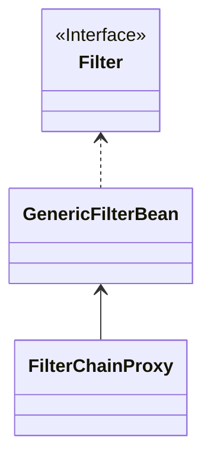

这个过滤器在内部又维护了一个`FilterChain`的列表,每个`FilterChain`都包含了一个`Filter`集合

```java
public class FilterChainProxy extends GenericFilterBean {
    private List<SecurityFilterChain> filterChains;
}
```

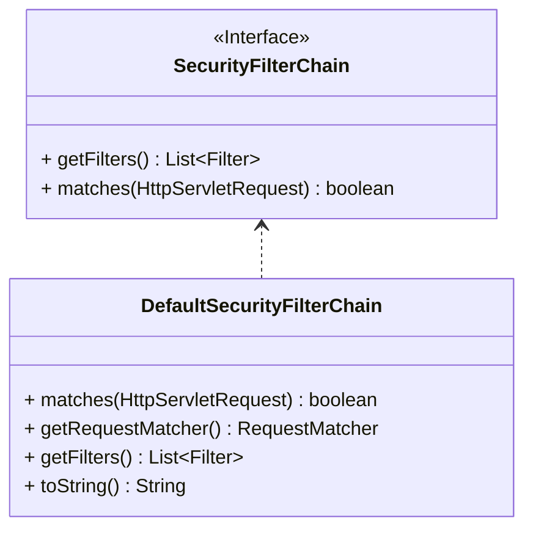

:::tip
`FilterChainProxy`之所以不直接维持一份`Filter`列表,而是又套了一层,维持了一份`SecurityFilterChain`列表,是因为`FilterChainProxy`想允许根据`请求的类型`选择不同的`FilterChain`来处理请求,可能某些场景下会用到

默认情况下`private List<SecurityFilterChain> filterChains;`这里面只有一个`DefaultSecurityFilterChain`
:::
所有的请求都会被`FilterChainProxy`拦截,然后根据请求的类型选择不同的`FilterChain`来处理请求.

```java
private void doFilterInternal(ServletRequest request, ServletResponse response, FilterChain chain)
			throws IOException, ServletException {
    //...
    List<Filter> filters = getFilters(firewallRequest);
    //...
}
```

在调试界面可以看到有许多的`Filter`被提取出来用于处理这次请求


这些过滤器负责应用安全的不同部分,比如`认证`、`授权`、`防火墙`等

这里是要了解登录流程,所以重点关注`UsernamePasswordAuthenticationFilter`这个过滤器

### UsernamePasswordAuthenticationFilter


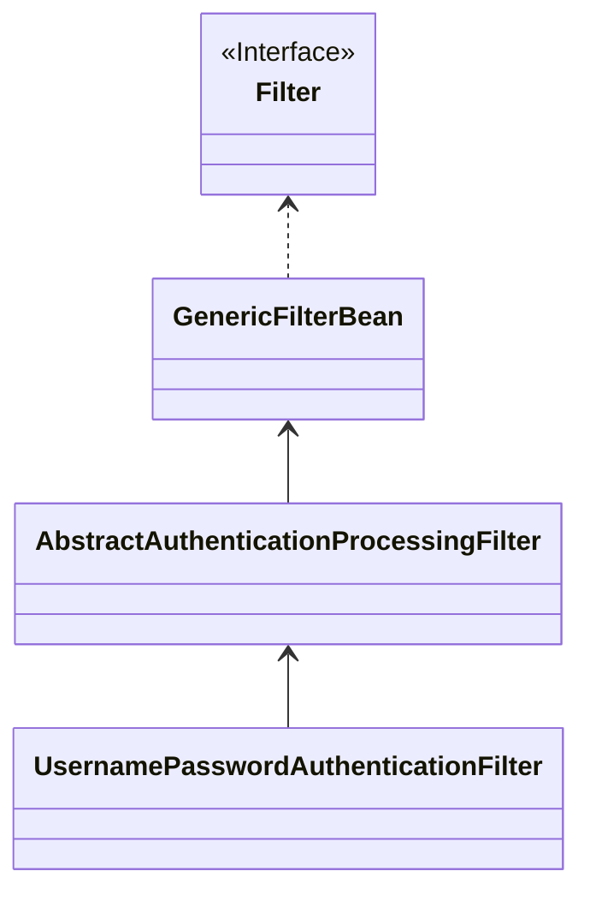

[AbstractAuthenticationProcessingFilter](https://docs.spring.io/spring-security/site/docs/current/api/org/springframework/security/web/authentication/AbstractAuthenticationProcessingFilter.html)这个过滤器是所有`认证`相关过滤器的父类,它的`doFilter`方法中会调用`attemptAuthentication`方法来尝试对请求进行认证

```java
public abstract class AbstractAuthenticationProcessingFilter extends GenericFilterBean
		implements ApplicationEventPublisherAware, MessageSourceAware {
		
        private void doFilter(HttpServletRequest request, HttpServletResponse response, FilterChain chain)
                throws IOException, ServletException {
            //...
            try {
                //...
                Authentication authenticationResult = attemptAuthentication(request, response);
                //...
            }
            //...
        }
}
```

然后看下[`UsernamePasswordAuthenticationFilter`](https://docs.spring.io/spring-security/site/docs/current/api/org/springframework/security/web/authentication/UsernamePasswordAuthenticationFilter.html)是怎么具体实现的


```java
public class UsernamePasswordAuthenticationFilter extends AbstractAuthenticationProcessingFilter {
    @Override
	public Authentication attemptAuthentication(HttpServletRequest request, HttpServletResponse response)
			throws AuthenticationException {
		if (this.postOnly && !request.getMethod().equals("POST")) {
			throw new AuthenticationServiceException("Authentication method not supported: " + request.getMethod());
		}
		String username = obtainUsername(request);
		username = (username != null) ? username.trim() : "";
		String password = obtainPassword(request);
		password = (password != null) ? password : "";
		UsernamePasswordAuthenticationToken authRequest = UsernamePasswordAuthenticationToken.unauthenticated(username,
				password);
		// Allow subclasses to set the "details" property
		setDetails(request, authRequest);
		return this.getAuthenticationManager().authenticate(authRequest);
	}
}
```

可以看到,它把请求中的用户名和密码提取出来,然后封装成一个[`UsernamePasswordAuthenticationToken`](https://docs.spring.io/spring-security/site/docs/4.0.x/apidocs/org/springframework/security/authentication/UsernamePasswordAuthenticationToken.html)对象,再调用[`AuthenticationManager`](https://docs.spring.io/spring-security/site/docs/current/api/org/springframework/security/authentication/AuthenticationManager.html)的`authenticate`方法进行认证.

### AuthenticationManager


可以看到这里使用[`ProviderManager`](https://docs.spring.io/spring-security/site/docs/current/api/org/springframework/security/authentication/ProviderManager.html)来进行认证

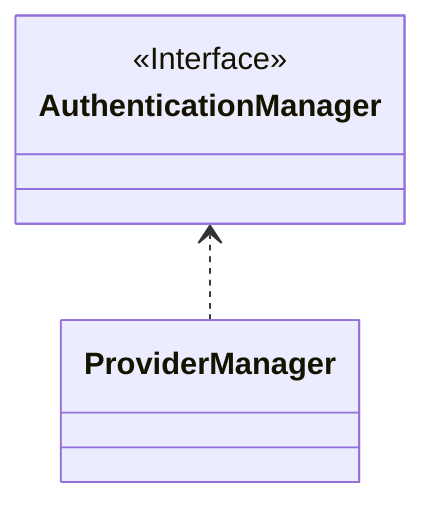

它是[`AuthenticationManager`](https://docs.spring.io/spring-security/site/docs/current/api/org/springframework/security/authentication/AuthenticationManager.html)的一个实现类,内部维护了一个`AuthenticationProvider`的列表

```java
public class ProviderManager implements AuthenticationManager, MessageSourceAware, InitializingBean {
    private List<AuthenticationProvider> providers = Collections.emptyList();
}

```
每个`AuthenticationProvider`都会尝试对`Authentication`进行认证,如果认证成功就返回一个`Authentication`对象,否则就抛出一个`AuthenticationException`异常.

:::tip
从这里可以看出来,如果想要扩展一种新的登录方法,比如用邮件或者验证码登录,只需要实现一个`AuthenticationProvider`就行了.
:::

```java
public class ProviderManager implements AuthenticationManager, MessageSourceAware, InitializingBean {
   @Override
	public Authentication authenticate(Authentication authentication) throws AuthenticationException {
	    //...
	    for (AuthenticationProvider provider : getProviders()) {
			if (!provider.supports(toTest)) {
				continue;
			}
			if (logger.isTraceEnabled()) {
				logger.trace(LogMessage.format("Authenticating request with %s (%d/%d)",
						provider.getClass().getSimpleName(), ++currentPosition, size));
			}
			try {
				result = provider.authenticate(authentication);
				if (result != null) {
					copyDetails(authentication, result);
					break;
				}
			}
			catch (AccountStatusException | InternalAuthenticationServiceException ex) {
				prepareException(ex, authentication);
				// SEC-546: Avoid polling additional providers if auth failure is due to
				// invalid account status
				throw ex;
			}
			catch (AuthenticationException ex) {
				lastException = ex;
			}
		}
	    //...
	}
}

```


要理解为什么不直接验证用户名和密码正确而是使用[`AuthenticationManager`](https://docs.spring.io/spring-security/site/docs/current/api/org/springframework/security/authentication/AuthenticationManager.html),需要先用一个例子来理一下`Spring Security`中关于`认证`的一些概念.

以`买票去电影院看电影`这件事为例,买票的过程就是一个[`认证(Authentication)`](https://docs.spring.io/spring-security/site/docs/4.0.x/apidocs/org/springframework/security/core/Authentication.html),里面包含了用户的`身份信息(买票时需要的材料)`和`凭证信息(票据凭证)`,以及用户的`权限信息(坐在几号厅哪一排哪一号)`等.

买票有很多种方法,比如网购、去售票处买、找黄牛买等,不同的渠道可能需要不同的材料,比如找黄牛买给钱就行,网上买的话可能需要提供身份证、手机号这些,不同渠道所需要的材料就是[`认证令牌(AbstractAuthenticationToken)`](https://docs.spring.io/spring-security/site/docs/current/api/org/springframework/security/authentication/AbstractAuthenticationToken.html)

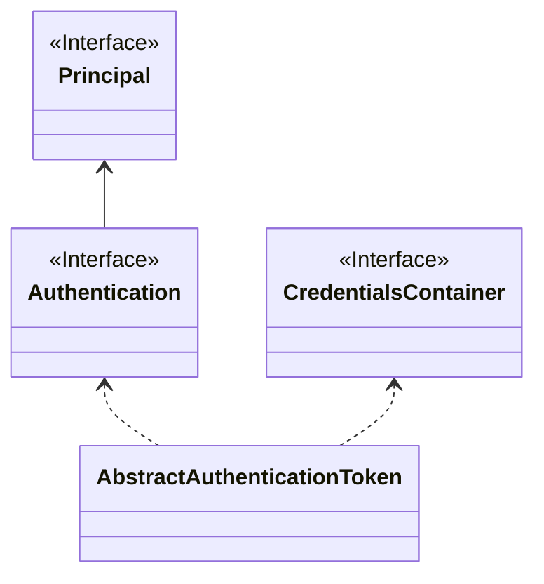

因为买票(登录)的方法有很多种,这时候就需要一个[`小秘(AuthenticationManager)`](https://docs.spring.io/spring-security/site/docs/current/api/org/springframework/security/authentication/AuthenticationManager.html)来帮我们屏蔽具体不同方法的细节,提供一个统一的接口,让我们只需要提供材料就行了.

[`小秘(AuthenticationManager)`](https://docs.spring.io/spring-security/site/docs/current/api/org/springframework/security/authentication/AuthenticationManager.html)拿到材料后,会去一个个尝试具体的[`方法(AuthenticationProvider)`](https://docs.spring.io/spring-security/site/docs/4.0.x/apidocs/org/springframework/security/authentication/AuthenticationProvider.html)


### AuthenticationProvider

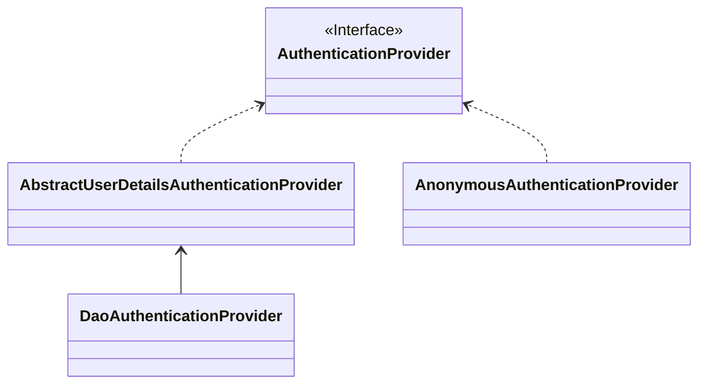

那默认情况下,`AuthenticationManager`到底使用哪个`AuthenticationProvider`呢?

```java
public class ProviderManager implements AuthenticationManager, MessageSourceAware, InitializingBean {
   @Override
	public Authentication authenticate(Authentication authentication) throws AuthenticationException {
	    //...
	    for (AuthenticationProvider provider : getProviders()) {...}
	    if (result == null && this.parent != null) {
            // Allow the parent to try.
            try {
                parentResult = this.parent.authenticate(authentication);
                result = parentResult;
            }
            catch (ProviderNotFoundException ex) {
                // ignore as we will throw below if no other exception occurred prior to
                // calling parent and the parent
                // may throw ProviderNotFound even though a provider in the child already
                // handled the request
            }
            catch (AuthenticationException ex) {
                parentException = ex;
                lastException = ex;
            }
		}
	    //...
	}
}

```

上面这段代码中,如果`ProviderManager`自己无法处理这个`Authentication`,还会尝试调用`parent`来处理,这里的`parent`也是一个`AuthenticationManager`

<ImageRenderer :value="images" width="5000" height="500"/>

通过上面的代码可以看到,最终处理请求的`AuthenticationProvider`是[`DaoAuthenticationProvider`](https://docs.spring.io/spring-security/site/docs/current/api/org/springframework/security/authentication/dao/DaoAuthenticationProvider.html)

`DaoAuthenticationProvider`没有重写`authenticate`方法,所以我们看一下它的父类[`AbstractUserDetailsAuthenticationProvider`](https://docs.spring.io/spring-security/site/docs/current/api/org/springframework/security/authentication/dao/AbstractUserDetailsAuthenticationProvider.html)的`authenticate`方法

```java
public abstract class AbstractUserDetailsAuthenticationProvider
		implements AuthenticationProvider, InitializingBean, MessageSourceAware {
        
        @Override
	public Authentication authenticate(Authentication authentication) throws AuthenticationException {
	    //...
	    String username = determineUsername(authentication);
		boolean cacheWasUsed = true;
		UserDetails user = this.userCache.getUserFromCache(username);
	    //...
	}

}
```
可以看到这里开始最后的认证流程了

先尝试从缓存中获取用户信息

```java
UserDetails user = this.userCache.getUserFromCache(username);
```

如果缓存中没有,再调用`retrieveUser`方法从数据持久层中获取用户信息

```java
if (user == null) {
    cacheWasUsed = false;
    try {
        user = retrieveUser(username, (UsernamePasswordAuthenticationToken) authentication);
    }
    catch (UsernameNotFoundException ex) {
        this.logger.debug("Failed to find user '" + username + "'");
        if (!this.hideUserNotFoundExceptions) {
            throw ex;
        }
        throw new BadCredentialsException(this.messages
                .getMessage("AbstractUserDetailsAuthenticationProvider.badCredentials", "Bad credentials"));
    }
    Assert.notNull(user, "retrieveUser returned null - a violation of the interface contract");
}
```

`DaoAuthenticationProvider`实现了`retrieveUser`方法

```java
public class DaoAuthenticationProvider extends AbstractUserDetailsAuthenticationProvider {

    @Override
	protected final UserDetails retrieveUser(String username, UsernamePasswordAuthenticationToken authentication)
			throws AuthenticationException {
		prepareTimingAttackProtection();
		try {
			UserDetails loadedUser = this.getUserDetailsService().loadUserByUsername(username);
			if (loadedUser == null) {
				throw new InternalAuthenticationServiceException(
						"UserDetailsService returned null, which is an interface contract violation");
			}
			return loadedUser;
		}
		catch (UsernameNotFoundException ex) {
			mitigateAgainstTimingAttack(authentication);
			throw ex;
		}
		catch (InternalAuthenticationServiceException ex) {
			throw ex;
		}
		catch (Exception ex) {
			throw new InternalAuthenticationServiceException(ex.getMessage(), ex);
		}
	}
}
```

然后调用`additionalAuthenticationChecks`方法检查用户信息是否正确,如果正确就返回一个`Authentication`对象,否则就抛出一个`AuthenticationException`异常.

### UserDetails

不同的业务系统中对`用户信息`的定义和存储都可能不一样,所以为了扩展性,`Spring Security`把`获取用户信息`这个过程抽象成了[UserDetails](https://docs.spring.io/spring-security/site/docs/current/api/org/springframework/security/core/userdetails/UserDetails.html)接口

你可以通过实现自定义的`UserDetailsService`来从不同的数据源,比如数据库、Redis甚至文件等获取用户信息

对于这个接口,`Spring Security`提供了一个默认的实现类[InMemoryUserDetailsManager](https://docs.spring.io/spring-security/site/docs/4.2.13.RELEASE/apidocs/org/springframework/security/provisioning/InMemoryUserDetailsManager.html)

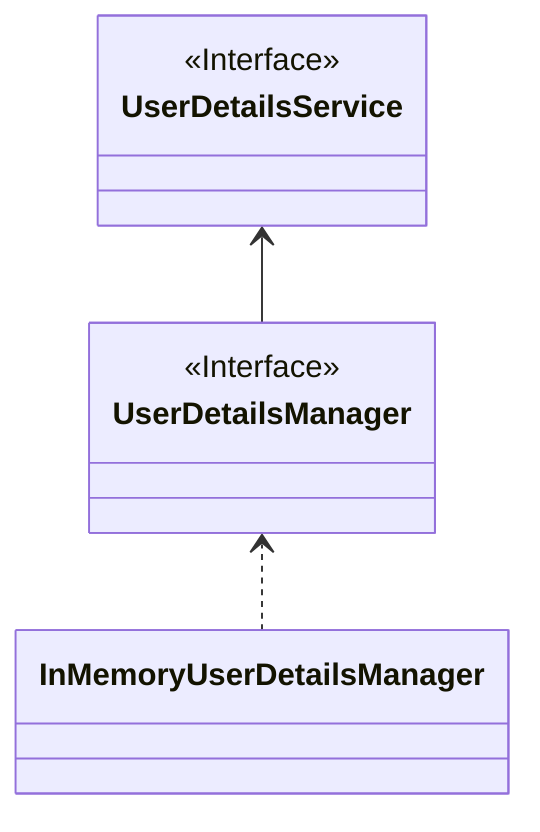

`InMemoryUserDetailsManager`中用一个`Map`来存储用户信息

```java

public class InMemoryUserDetailsManager implements UserDetailsManager, UserDetailsPasswordService {
    private final Map<String, MutableUserDetails> users = new HashMap<>();
}

```

然后实现了`UserDetailsService`接口要求的`loadUserByUsername`方法

```java
@Override
public UserDetails loadUserByUsername(String username) throws UsernameNotFoundException {
    UserDetails user = this.users.get(username.toLowerCase());
    if (user == null) {
        throw new UsernameNotFoundException(username);
    }
    return new User(user.getUsername(), user.getPassword(), user.isEnabled(), user.isAccountNonExpired(),
            user.isCredentialsNonExpired(), user.isAccountNonLocked(), user.getAuthorities());
}
```

刚才我们使用`sdf`和`123`登录时,控制台提示`Failed to find user 'sdf'`就是在这里完成的

```text
2023-12-28T16:11:17.294+08:00 DEBUG 25440 --- [nio-8084-exec-4] o.s.s.a.dao.DaoAuthenticationProvider    : Failed to find user 'sdf'
```

校验用户名的整个流程已经弄清楚了,现在我们尝试使用`正确的用户名(user)`和`错误的密码(任意,比如sss)`来登录,看看密码是怎么校验的.

当正确获取到用户信息后,首先使用[`UserDetailsChecker`](https://docs.spring.io/spring-security/site/docs/4.0.x/apidocs/org/springframework/security/core/userdetails/UserDetailsChecker.html)来检查用户状态,确保用户没有被锁定、过期等


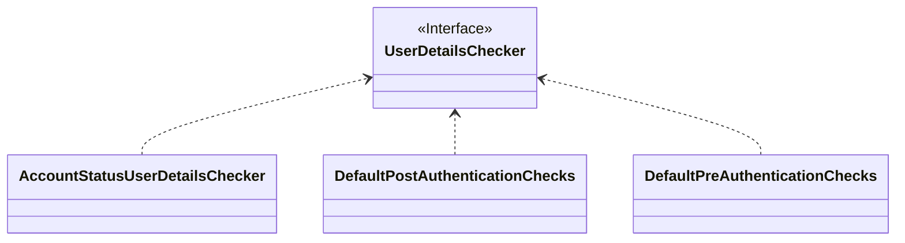

```java
public abstract class AbstractUserDetailsAuthenticationProvider
		implements AuthenticationProvider, InitializingBean, MessageSourceAware {
		
		private UserDetailsChecker preAuthenticationChecks = new DefaultPreAuthenticationChecks();
		@Override
	public Authentication authenticate(Authentication authentication) throws AuthenticationException {
	    //...
	    try {
			this.preAuthenticationChecks.check(user);
			additionalAuthenticationChecks(user, (UsernamePasswordAuthenticationToken) authentication);
		}
	    //...
	}
		
}

```

然后`additionalAuthenticationChecks`执行附加检查,由具体子类实现.

然后我们就可以看到`DaoAuthenticationProvider`在这个方法中实现了对密码的检查

```java
public class DaoAuthenticationProvider extends AbstractUserDetailsAuthenticationProvider {
    @Override
	@SuppressWarnings("deprecation")
	protected void additionalAuthenticationChecks(UserDetails userDetails,
			UsernamePasswordAuthenticationToken authentication) throws AuthenticationException {
		if (authentication.getCredentials() == null) {
			this.logger.debug("Failed to authenticate since no credentials provided");
			throw new BadCredentialsException(this.messages
					.getMessage("AbstractUserDetailsAuthenticationProvider.badCredentials", "Bad credentials"));
		}
		String presentedPassword = authentication.getCredentials().toString();
		if (!this.passwordEncoder.matches(presentedPassword, userDetails.getPassword())) {
			this.logger.debug("Failed to authenticate since password does not match stored value");
			throw new BadCredentialsException(this.messages
					.getMessage("AbstractUserDetailsAuthenticationProvider.badCredentials", "Bad credentials"));
		}
	}
}
```

### PasswordEncoder

为了防止明文存储密码带来的安全隐患,`Spring Security`提供了一个[`PasswordEncoder`](https://docs.spring.io/spring-security/site/docs/current/api/org/springframework/security/crypto/password/PasswordEncoder.html)接口,用于对密码进行加密和匹配

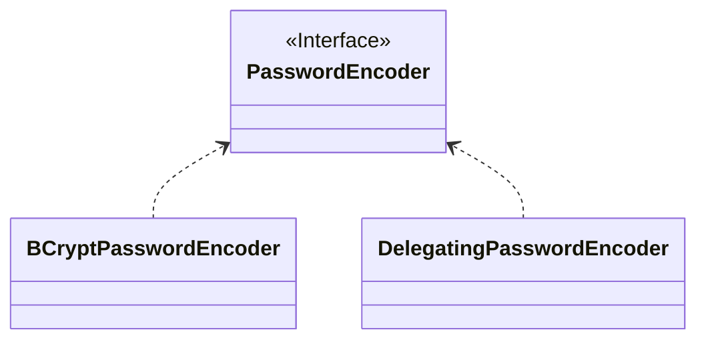

由于我们使用了一个错误的密码,所以这里抛出了一个`BadCredentialsException`异常

```java
if (!this.passwordEncoder.matches(presentedPassword, userDetails.getPassword())) {
			this.logger.debug("Failed to authenticate since password does not match stored value");
			throw new BadCredentialsException(this.messages
					.getMessage("AbstractUserDetailsAuthenticationProvider.badCredentials", "Bad credentials"));
		}
```

这个异常会被`ProviderManager`捕获,然后通过[AuthenticationEventPublisher](https://docs.spring.io/spring-security/site/docs/4.0.x/apidocs/org/springframework/security/authentication/AuthenticationEventPublisher.html)发布给监听者做后续处理

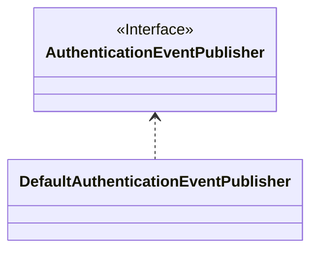

```java
public class ProviderManager implements AuthenticationManager, MessageSourceAware, InitializingBean {
    @Override
    public Authentication authenticate(Authentication authentication) throws AuthenticationException {
        //...
        if (parentException == null) {
			prepareException(lastException, authentication);
		}
        //...
    }
    
    private void prepareException(AuthenticationException ex, Authentication auth) {
        this.eventPublisher.publishAuthenticationFailure(ex, auth);
    }
}
```

### AuthenticationFailureHandler

`Authentication`会被`AbstractAuthenticationProcessingFilter`捕获,并交给`failureHandler`来处理

```java
public abstract class AbstractAuthenticationProcessingFilter extends GenericFilterBean
		implements ApplicationEventPublisherAware, MessageSourceAware {
		
		private AuthenticationSuccessHandler successHandler = new SavedRequestAwareAuthenticationSuccessHandler();
		private AuthenticationFailureHandler failureHandler = new SimpleUrlAuthenticationFailureHandler();
        
        
        private void doFilter(HttpServletRequest request, HttpServletResponse response, FilterChain chain)
                throws IOException, ServletException {
            //...
            try {
                //...
                successfulAuthentication(request, response, chain, authenticationResult);
            }
            catch (InternalAuthenticationServiceException failed) {
                this.logger.error("An internal error occurred while trying to authenticate the user.", failed);
                unsuccessfulAuthentication(request, response, failed);
            }
            catch (AuthenticationException ex) {
                // Authentication failed
                unsuccessfulAuthentication(request, response, ex);
            }
        }
}
```

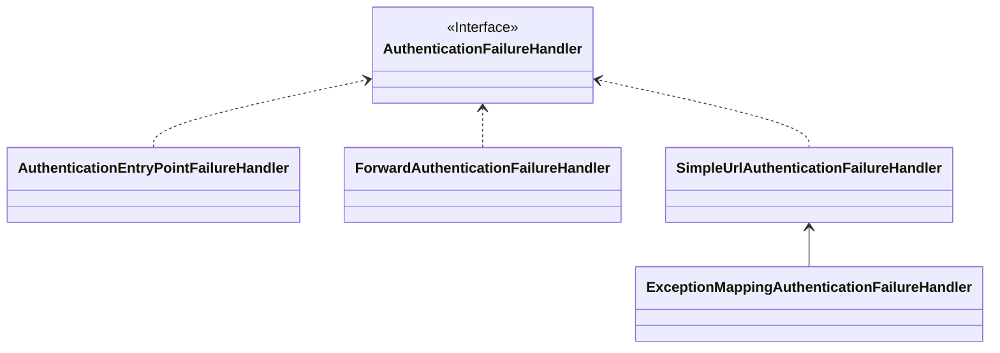

在默认情况下,登录失败后跳转到`/login`就是由[`SimpleUrlAuthenticationFailureHandler`](https://docs.spring.io/spring-security/site/docs/4.2.6.RELEASE/apidocs/org/springframework/security/web/authentication/SimpleUrlAuthenticationFailureHandler.html)这个实现类来处理的


登录成功的情况由[`AuthenticationSuccessHandler`](https://docs.spring.io/spring-security/site/docs/current/api/org/springframework/security/web/authentication/AuthenticationSuccessHandler.html)处理

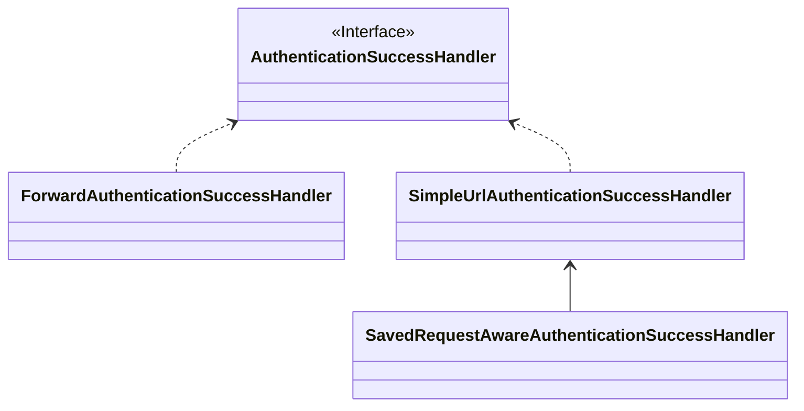
