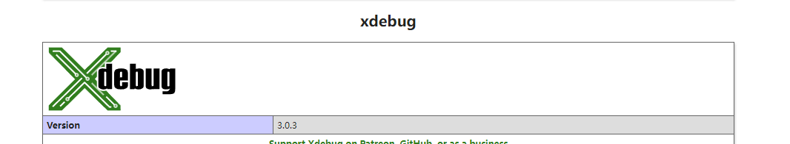
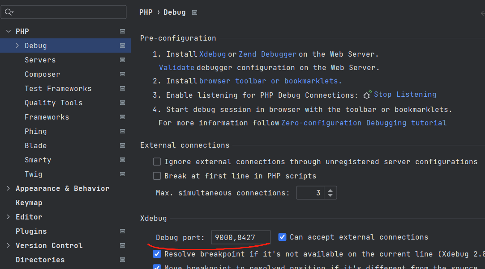
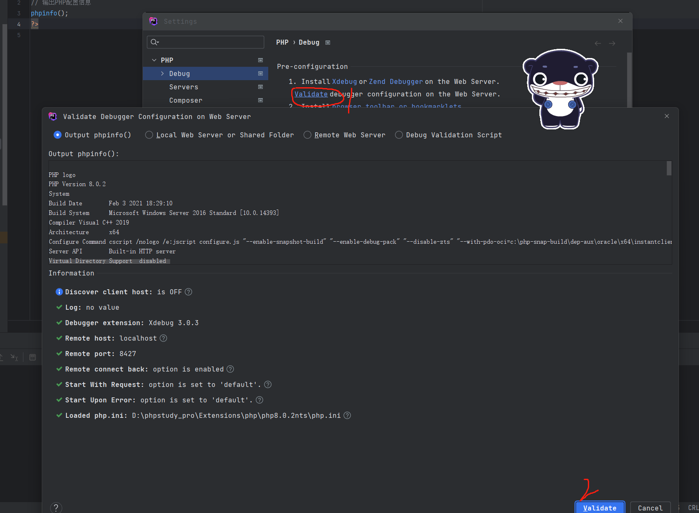
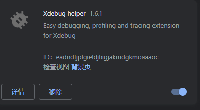
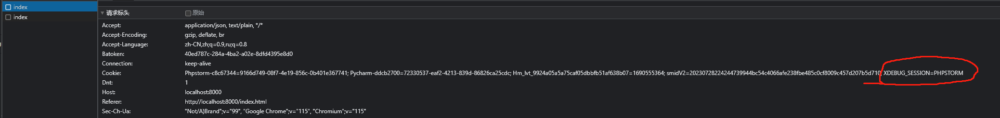
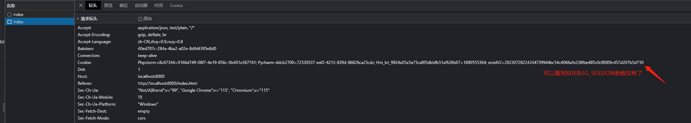
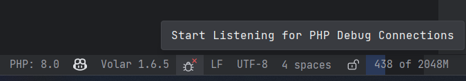
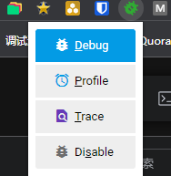
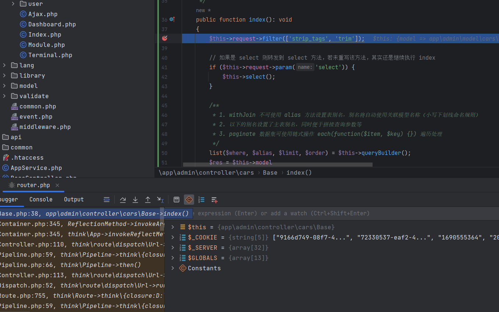

## PhpStorm配置xdebug


首先在php.ini中启用xdebug
```yaml
[Xdebug]
zend_extension=D:/phpstudy_pro/Extensions/php/php8.0.2nts/ext/php_xdebug.dll
xdebug.collect_params=1
xdebug.collect_return=1
xdebug.auto_trace=On
xdebug.trace_output_dir=D:/phpstudy_pro/Extensions/php_log/php8.0.2nts.xdebug.trace
xdebug.profiler_enable=On
xdebug.profiler_output_dir=D:/phpstudy_pro/Extensions/php_log/php8.0.2nts.xdebug.profiler
xdebug.remote_enable=1
xdebug.remote_host=localhost
xdebug.remote_port=9000
xdebug.remote_handler=dbgp
xdebug.mode=debug
xdebug.client_port=8427
xdebug.remote_cookie_expire_time = 3600
```

==1.== 然后查看`phpinfo`确保`xdebug`已经启用,如下图所示



==2.== 再按`ctrl+a`把`phpinfo.php`上的内容全部复制下来


==3.== 在`phpstorm`中配置好端口号,如下图所示



==4.== 最后验证`xdebug`安装是否成功,如下图所示



==5.== 浏览器安装`xdebug`插件,如下图所示



::: tip
不装这个插件也可以调试,但是不装的话相当于所有请求都要调试,包括图片、js这些,会导致调试很慢

所以装这个插件的意义在于可以随时禁用调试,只有在需要调试的时候才启用调试

可以通过对比一下使用这个插件前后的再次相同请求:

| 插件选中为`Debug`模式          | 插件选中为`Disable`模式        |
|-------------------------|-------------------------|
|  |  |

:::

## 测试

==1.== 下断点

==2.== `phpstorm`监听调试端口,如图



==3.== 在要调试的页面点击`Debug`按钮,如图



==4.== 发送请求,开始调试,如图



## 参考链接

* [IntelliJ IDEA 在校验 PHP Debug 配置的时候提示 Xdebug 扩展没有载入-腾讯云开发者社区-腾讯云](https://cloud.tencent.com/developer/article/1946213)
* [(162条消息) phpstorm apache php xdebug调试超时设置_phpstorm 设置调试时间_xkdlzy的博客-CSDN博客](https://blog.csdn.net/xkdlzy/article/details/110880645)
