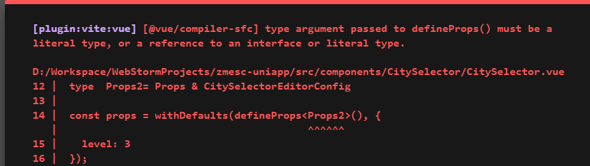

## 简介

::: tip
``defineProps``函数用于自定义组件时定义组件参数
:::

## 不带默认值
```vue
<template><span>{{props.label}}</span></template>
<script lang="ts" setup>
  interface Props {
    label?: string;

    [key: string]: any; // 添加索引签名
  }

  const props = defineProps<Props>()
  
</script>
<style></style>
```

## 带默认值

::: info 
带默认值的话需要用到``withDefaults``函数
:::

```vue
<template><span>{{props.label}}</span></template>
<script lang="ts" setup>
  interface Props {
    label?: string;

    [key: string]: any; // 添加索引签名
  }

  const props = withDefaults(defineProps<Props>(), {
    label: 'hello',
  })
  
</script>
<style></style>
```

## 动态props

:::tip
假如vue子组件有3个prop,分别是name,id,code

怎样实现父组件传递的时候直接用一个对象传递,子组件自动展开?
:::

答案是使用``v-bind``指令:
::: code-tabs#dynamicProps
@tab:active 子组件
```vue
<template><span>{{props.label}}</span></template>
<script lang="ts" setup>
  interface Props {
    name?: string;
    id?: string;
    code?: string;

    [key: string]: any; // 添加索引签名
  }

  const props = defineProps<Props>()
  
</script>
<style></style>
```
@tab 父组件
```vue
<template>
  <child v-bind="{
      id:1,
      name:'test',
      code:1001
  }" />
</template>
<script lang="ts" setup>
import Child from './child.vue'
</script>
<style></style>
```
:::

::: warning 
要使用``v-bind``指令传递动态``props``,需要在子组件中明确声明所有``prop``,没在``props``里定义,但父组件又传过来的属性会被放到``attrs``对象中
:::


## 使用导入的接口
``vue3.3``以前不能在``defineProps``中使用导入的接口和[交叉类型](../typescript/交叉类型.md#简介)

```vue
<script setup lang="ts">

  import {CitySelectorEditorConfig, IAdministrativeArea} from '@/components/CitySelector/models';

  interface Props  {
    modelValue: IAdministrativeArea
    [k:string]:any
  }

  type  Props2= Props & CitySelectorEditorConfig

  const props = withDefaults(defineProps<Props2>(), {
    level: 3
  });
</script>

```

上面这段代码会在运行时报如下错误:




## 参考

- [Vue3 - $attrs 的几种用法（1个或多个根元素、Options API 和 Composition API） | Vue.js 技术论坛](https://learnku.com/articles/69014)
- [Vue3.3 正式发布！ - 掘金](https://juejin.cn/post/7231853294409531449)
- [How to import interface for defineProps · Issue #4294 · vuejs/core](https://github.com/vuejs/core/issues/4294)
