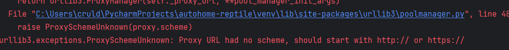

## 安装

```pip install selenium```

::: tip
如果安装的很慢，可以[使用国内镜像](../pip.md#使用国内镜像)
:::

## 简单的例子

```python
from selenium import webdriver

if __name__ == '__main__':
    driver = webdriver.Chrome()
    driver.get('https://baidu.com')
    driver.quit()
```


## 设置代理

```python
from selenium import webdriver

PROXY = "127.0.0.1:8080" # 设置代理IP和端口号

chrome_options = webdriver.ChromeOptions()
chrome_options.add_argument('--proxy-server=http://%s' % PROXY)

# 创建一个DesiredCapabilities对象
capabilities = webdriver.DesiredCapabilities.CHROME.copy()
capabilities['acceptSslCerts'] = True
capabilities['acceptInsecureCerts'] = True

# 使用代理启动Chrome浏览器
driver = webdriver.Chrome(chrome_options=chrome_options, desired_capabilities=capabilities)

# 访问网页
driver.get("https://www.example.com")
```

## 无头模式

```python
from selenium import webdriver
from selenium.webdriver.chrome.options import Options

chrome_options = Options()
chrome_options.add_argument('--headless')#开启无头模式，即不显示浏览器窗口。
chrome_options.add_argument('--disable-gpu') #禁用GPU加速，可以避免一些兼容性问题
chrome_options.add_argument('--no-sandbox')#禁用沙箱选项，可以提高性能和安全性

driver = webdriver.Chrome(options=chrome_options)
```

## 常见问题

### Proxy URL had no scheme, should start with http:// or https://



::: info
原因是本地设置了代理,但是格式又不被`selenium`支持,解决办法是设置正确的格式或者忽略本地的代理设置

```python
from selenium import webdriver

if __name__ == '__main__':
    chrome_options = Options()
    chrome_options.ignore_local_proxy_environment_variables()
    driver = webdriver.Chrome(chrome_options)
    driver.get('https://baidu.com')
    driver.quit()
```
:::
