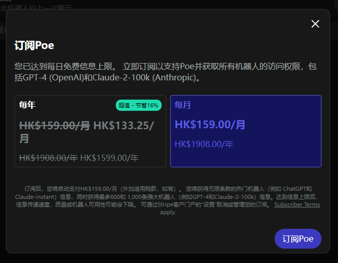

## 登录

- [x] (登录)表设计
- [x] (登录)短信验证码登录
- [ ] 微信扫码登录
- [x] 登录界面,参考[poe](https://poe.com/login?redirect_url=%2FChatGPT)
- [ ] 📱登录页面响应式布局
- [x] 捕获到`403`错误后重定向到登录页

## 应用管理

- [x] 表设计
- [x] 基本信息接口(返回名称、图标、标题、副标题、网站备案等)
- [x] 在页面上合适的位置使用基本信息
- [x] 找出这一块的代码,从自己的服务器获取是否需要更新

## 聊天

- [x] ✨权限控制,没有权限就弹出订阅窗口
- [x] 💄[订阅页面](https://codepen.io/inescodes/pen/PoxMyvX),上面放价格列表,下面放具体的功能列表
- [x] 💄也可以做简单点
- [x] 💄订阅页面如果做成弹框的话就需要一个单独的页面来查看当前订阅计划
- [x] 把模型设置相关按钮隐藏掉
- [ ] 上下文token如果到达限制要如何处理?(捕获限制相关的[错误](https://poe.com/s/lZ6FwqIjHH0UpAZTKqfA),然后切换到可用账号继续,再在单独的线程中更新账号可用状态)
- [ ] ~~话题功能隐藏掉,原来的位置换成"新建聊天",然后把角色设定放到下面~~<ImageRenderer :value="images3" />

## 机器人

- [x] 把新建助手(机器人)暂时关掉,一律从商店获取
- [x] 把助手(机器人)菜单隐藏掉

## `AI`相关接口用`java`重写

- [x] ✨`openai`聊天接口
- [x] ✨`openai`绘图接口
- [x] ✨`openai`语音接口
- [ ] ✨`mj`绘图插件
- [ ] ✨`sd`绘图插件
- [ ] ~~研究下[这个](https://github.com/snowby666/poe-api-wrapper),利用`poe`实现免费`gpt3`接口(没跑起来,估计也不够稳定)~~

## 其它

- [x] ✨阿里云短信
- [ ] ✨微信支付
- [x] ✨支付宝支付
- [ ] ✨域名备案
- [ ] 💄用户协议和隐私政策页面
- [ ] ✨裂变模块

## 管理后台

## 速度限制

### 参考

* [Limits - OpenAI API](https://platform.openai.com/account/limits)
* [Context length VS Max token VS Maximum length - API - OpenAI Developer Forum](https://community.openai.com/t/context-length-vs-max-token-vs-maximum-length/125585)
* [Models - OpenAI API](https://platform.openai.com/docs/models/gpt-3-5)
* [Understanding OpenAI Rate Limits and Available Tiers | by Mark Craddock | Prompt Engineering | Nov, 2023 | Medium](https://medium.com/prompt-engineering/understanding-openai-rate-limits-and-available-tiers-10caeb79d120)
