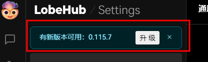
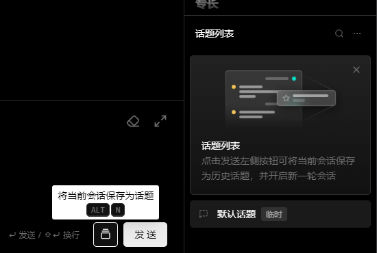
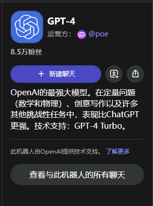
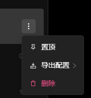

## 登录

- [x] (登录)表设计
- [x] (登录)短信验证码登录
- [ ] 微信扫码登录
- [x] 登录界面,参考[poe](https://poe.com/login?redirect_url=%2FChatGPT)
- [ ] 登录页面响应式布局
- [ ] 捕获到`403`错误后重定向到登录页

## 应用管理

- [x] 表设计
- [x] 基本信息接口(返回名称、图标、标题、副标题、网站备案等)
- [x] 在页面上合适的位置使用基本信息
- [x] 找出这一块的代码,从自己的服务器获取是否需要更新

## 聊天

- [ ] 权限控制,没有权限就弹出订阅窗口
- [ ] 把这三个按钮隐藏掉
- [ ] 上下文token如果到达限制要如何处理?
- [ ] 话题功能隐藏掉,原来的位置换成"新建聊天",界面参考然后把角色设定放到下面

## 机器人

- [ ] 把新建助手(机器人)暂时关掉,一律从商店获取
- [ ] 把助手(机器人)菜单隐藏掉

## `AI`相关接口用`java`重写

- [x] `openai`聊天接口
- [ ] 绘图接口
- [ ] ~~研究下[这个](https://github.com/snowby666/poe-api-wrapper),利用`poe`实现免费`gpt3`接口(没跑起来,估计也不够稳定)~~

## 其它

- [x] 阿里云短信
- [ ] 微信扫码登录
- [ ] 微信支付
- [ ] 支付宝支付
- [ ] 域名备案
- [ ] 用户协议和隐私政策页面
