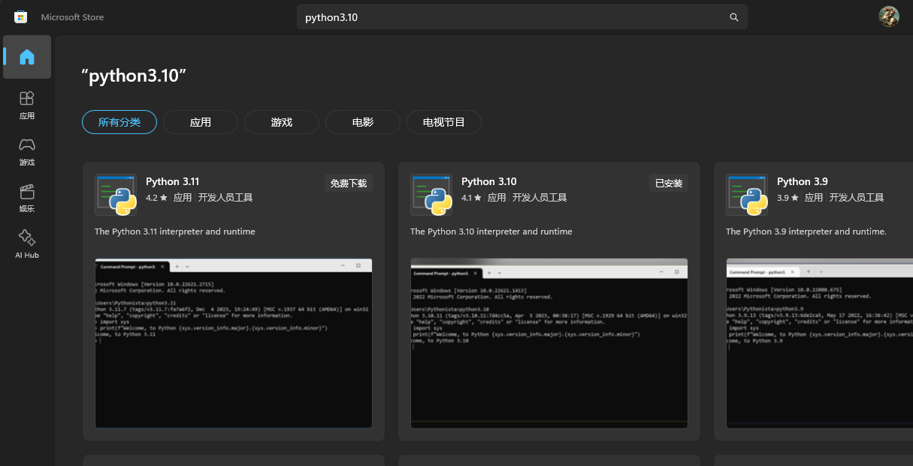
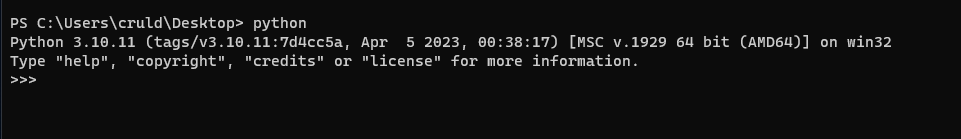
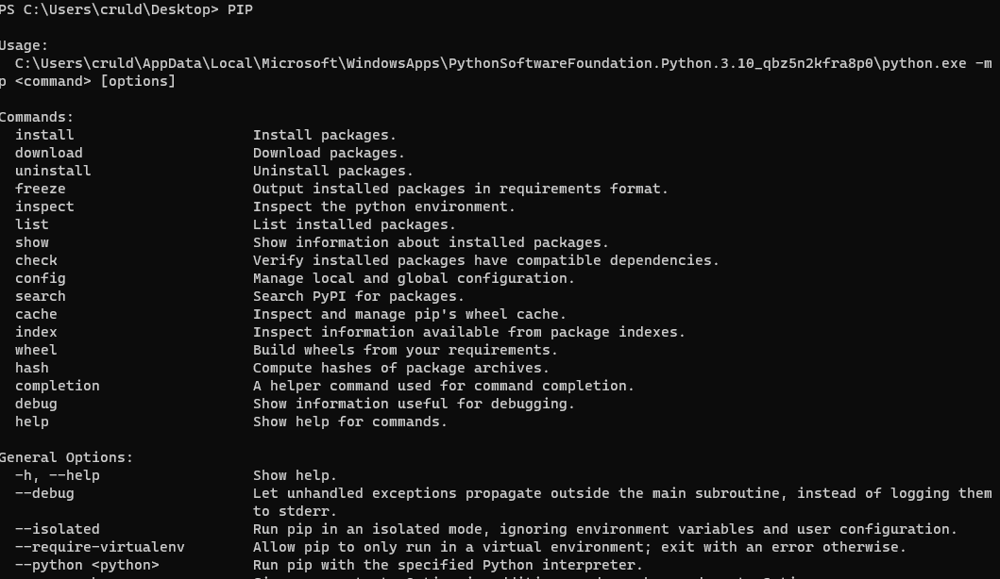
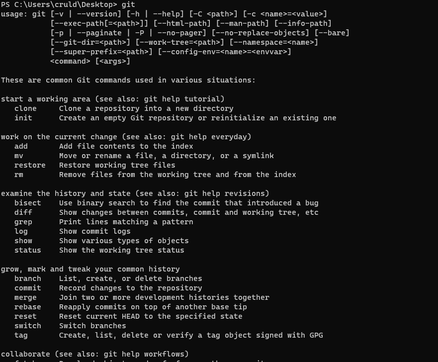
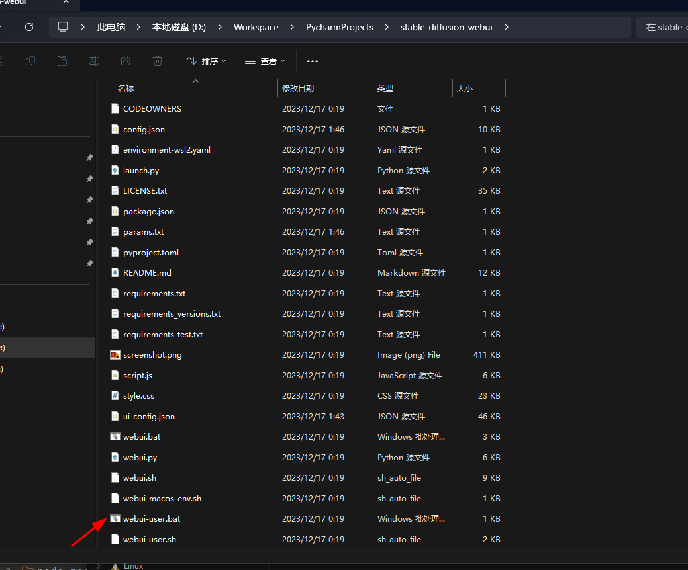
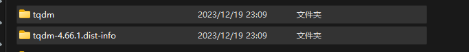
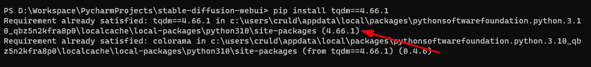

## 简介

[Stable Diffusion web UI](https://github.com/AUTOMATIC1111/stable-diffusion-webui)是[Stable Diffusion](https://stability.ai/stable-diffusion)的用户界面,使用户可以通过简单的界面来生成和修改图像

## 安装
先下载代码
```bash
git clone https://github.com/AUTOMATIC1111/stable-diffusion-webui.git
```

### windows

#### 安装[python3.10.6](https://www.python.org/downloads/release/python-3106/)

需要配置好`python`和`pip`环境变量,最好是通过`exe`方式安装,安装界面上勾选安装pip

`python`版本一定要3.10.6,更高的版本不支持`torch`

也可以用微软商店安装



安装好以后在新建一个命令行窗口分别输入`python`和`pip`查看是否安装成功





#### 安装git

点[git下载地址](https://git-scm.com/downloads)下载安装即可

确认一下是否安装成功



#### 自动安装

找到第一步下载的代码,双击里面目录里面的`webui-user.bat`即可自动安装




## 启动

双击安装目录里面的`webui.bat`即可启动
<script setup lang="ts">
 
const src = `${import.meta.env.BASE_URL}assets/start-sdwebui.mp4`
 const src1 = `${import.meta.env.BASE_URL}assets/安装汉化插件.mp4`
 const src2 = `${import.meta.env.BASE_URL}assets/应用语言设置.mp4`
</script>

<VidStack :src="src" />


## 汉化

先安装汉化插件

<VidStack :src="src1" />

然后再应用语言设置

<VidStack :src="src2" />

## 常用模型

### [EasyNegative](https://civitai.com/models/7808/easynegative)

主要作用是整合一些常用的反向提示词.

在使用`Stable Diffusion`等AI绘画工具时,`反向提示词(Negative prompt)`是用来描述我们不希望在生成的图像中出现的内容

`EasyNegative`模型将这些常用的反向提示词整合在一起,使得用户只需输入简单的关键词就能得到较好的效果,从而提高生成图像的质量

## 常用插件

### [ControlNet](https://github.com/Mikubill/sd-webui-controlnet)

这个插件可以实现对生成的图像进行精准的控制,例如控制人物的姿势和表情

### [adetailer](https://github.com/Bing-su/adetailer)

这个插件用于精修人物的面部、手部和全身细节

### [Reactor](https://github.com/Gourieff/sd-webui-reactor)

这个插件用于对人物换脸

<VidStack
src="https://www.youtube.com/watch?v=JFq-JcgsAS8"
title="VidStack YouTube Demo"
/>

### [TemporalKit](https://github.com/CiaraStrawberry/TemporalKit)


## 常见问题

### CUDA out of memory
显示不够,可以通过`nvidia-smi`看下当前占用

### 安装TemporalKit提示`No module named 'tqdm.auto'`

原因是`tqdm`版本太低,需要升级,具体步骤如下:

1. 先删除`sd-webui根目录/venv/Lib/site-packages`下的这两个文件夹



2. 在`sd-webui`根目录下打开命令行窗口,输入`pip install tqdm==4.66.1`升级`tqdm`,然后会看到如下提示



3. 把第2步中安装的`tqdm`文件夹复制到`sd-webui根目录/venv/Lib/site-packages`下


## 参考

* [Civitai Models | Discover Free Stable Diffusion Models](https://civitai.com/models)
* [Stable Diffusion 入门指南-1 - 知乎](https://zhuanlan.zhihu.com/p/645820130)
