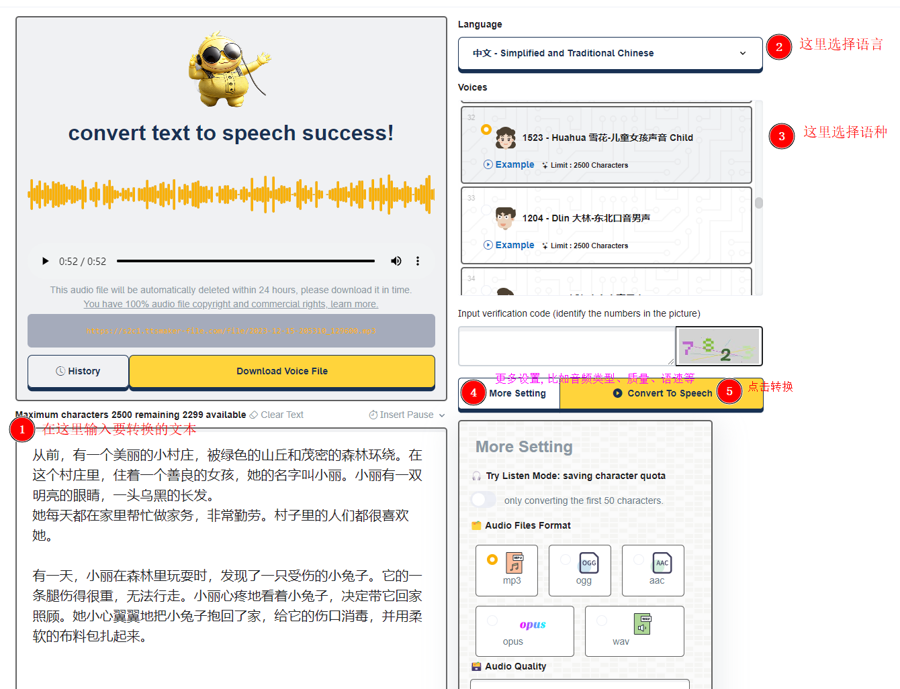

## 简介

[TTSMaker](https://ttsmaker.com/)是一个用于生成语音的工具,它可以将文本转换为语音,并且可以指定语音的发音人,语速,音量,语调等参数.

## 使用教程

[]

## 实例

```text
从前，有一个美丽的小村庄，被绿色的山丘和茂密的森林环绕。在这个村庄里，住着一个善良的女孩，她的名字叫小丽。小丽有一双明亮的眼睛，一头乌黑的长发。
她每天都在家里帮忙做家务，非常勤劳。村子里的人们都很喜欢她。

有一天，小丽在森林里玩耍时，发现了一只受伤的小兔子。它的一条腿伤得很重，无法行走。小丽心疼地看着小兔子，决定带它回家照顾。她小心翼翼地把小兔子抱回了家，给它的伤口消毒，并用柔软的布料包扎起来。
```

<script setup lang="ts">
import { onMounted } from 'vue';
// onMounted(() => {
//   alert(JSON.stringify(import.meta.env))
// })

const src = `${import.meta.env.BASE_URL}assets/ttsmaker-file-2023-12-15-20-53-28.mp3`
const coverImage = `${import.meta.env.BASE_URL}assets/images/cover1.jpg`
// alert(src)
const options = {
src,
title: 'your-audio-title',
coverImage
}
</script>

<AudioPlayer     :option="options" />
