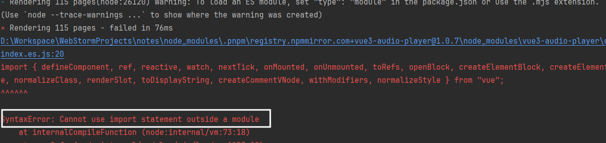

## 引入[vue3-audio-player](https://github.com/RealCoolSnow/vue3-audio-player?tab=readme-ov-file)组件报错的问题

首先使用下面的代码引用组件:

```ts
//.vuepress/client.ts

import  AudioPlayer from 'vue3-audio-player'
import 'vue3-audio-player/dist/style.css'
export default defineClientConfig({
    enhance: ({ app, router, siteData }) => {
        app.component("AudioPlayer", AudioPlayer);
    },
});

```

然后`pnpm run docs:build`报错:



原因是`vue3-audio-player`这个组件中有不兼容`ssr`的代码,需要在`vite`配置中将其排除

```ts

//.vuepress/config.ts
export default defineUserConfig({
    bundler: viteBundler({
        viteOptions: {
            ssr: {
                // SSR 相关配置
                noExternal: ['vue3-audio-player'],
            }
        }
    })
})
```

## 几个问题

### 为什么`dev`环境下正常?

因为`dev`模式使用的`csr`,构建时有使用到`ssr`,但是这个库里面有不兼容`ssr`的代码,所以构建时报错

## 参考

* [解决思路](https://poe.com/s/pLw7k4GfNuehVWe7OUWo)
