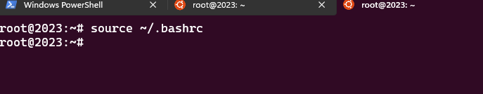
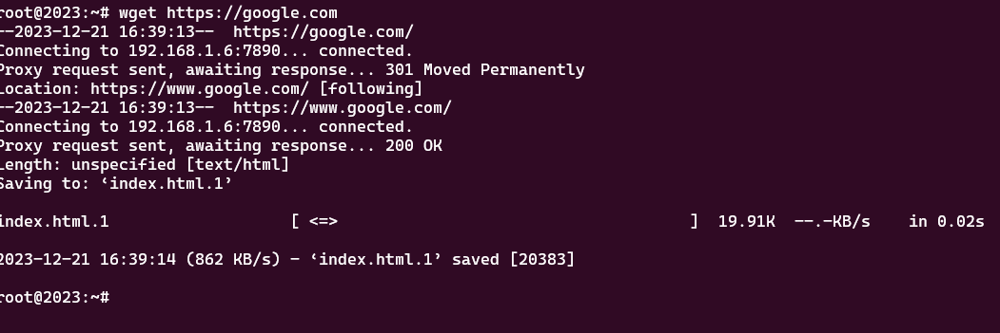

## 步骤

1. 在文件资源管理器上面的地址栏输入`\\wsl.localhost\Ubuntu-22.04\home\$user_name$`
2. 双击`.bashrc`文件用`VSCode`或者其它你喜欢的编辑器打开
3. 在文件末尾添加如下内容:

```bash
export http_proxy="http://192.168.1.6:7890"
export https_proxy="http://192.168.1.6:7890"
```
4. 打开一个`wsl`窗口,输入`source ~/.bashrc`使其生效



5. `curl`尝试下载`google`首页来检查是否成功


