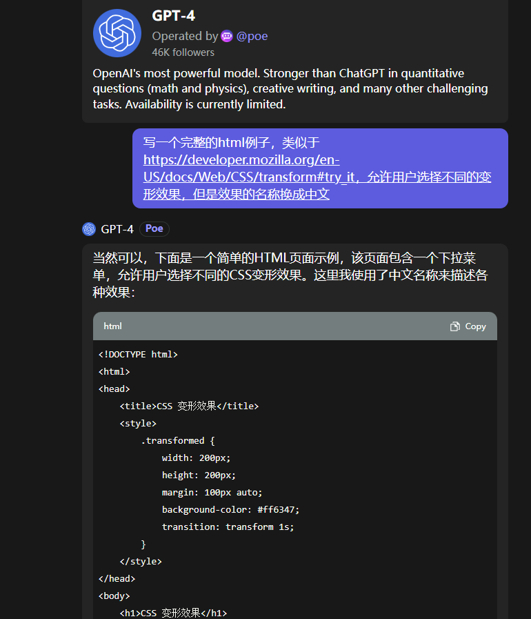
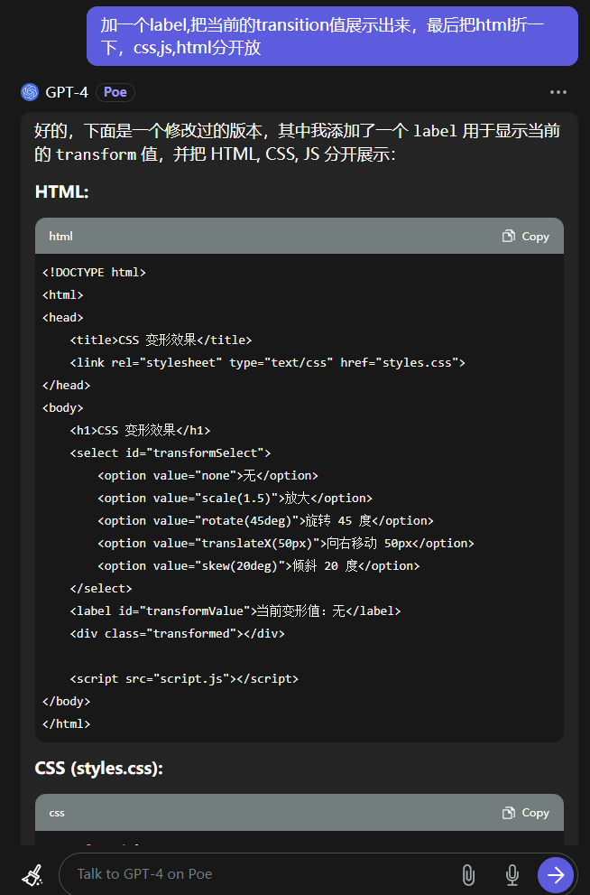
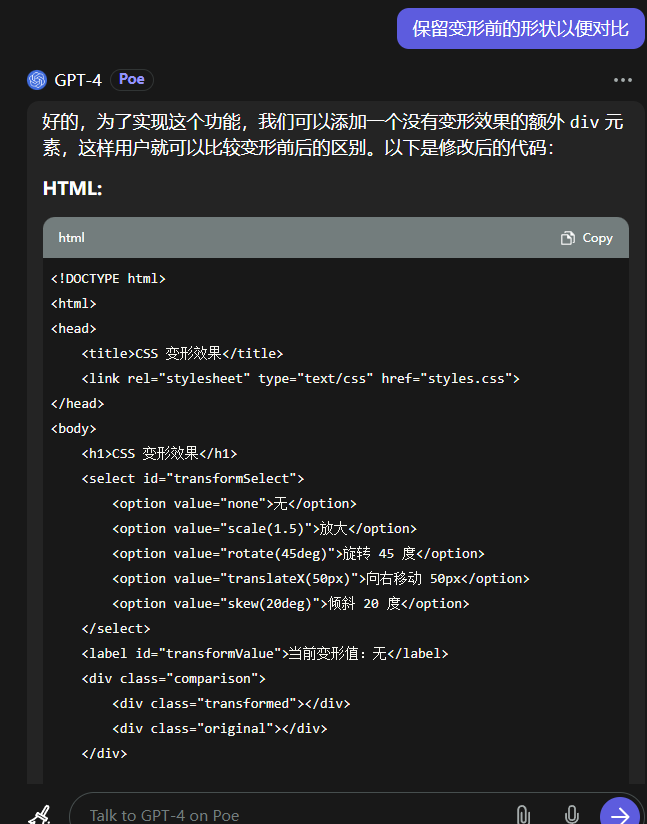

## 简介

[``transform``](https://developer.mozilla.org/en-US/docs/Web/CSS/transform)是CSS3中的一个属性,可以用来对元素进行==变形操作==,包括
**旋转**、**缩放**、**倾斜**和**平移**等

::: tip
严格来说这个属性不是动画属性,它只是将元素变形,但是它可以和[``transition``](https://developer.mozilla.org/en-US/docs/Web/CSS/transition)
属性一起使用,从而实现动画效果
:::

:::tip
``transform``这个单词是一个动词,中文意思是变形、转换,就是==从一个形状变成另一个形状==的意思,如果不和``transition``一起配合使用的话,那它就是将元素本来的形状按照指定的规则变形后直接展示,
不会让你感知到变形的过程,也就是说没有动画效果,而``transition``属性就是让你感知到变形的过程,从而产生动画效果
:::
## 示例

:::tip
下面这个例子用到了几下几个[``变形函数``](https://developer.mozilla.org/zh-CN/docs/Web/CSS/transform-function)
* 缩放-[``scale``](https://developer.mozilla.org/zh-CN/docs/Web/CSS/transform-function/scale)
* 旋转-[``rotate``](https://developer.mozilla.org/zh-CN/docs/Web/CSS/transform-function/rotate)
* 平移-[``translate``](https://developer.mozilla.org/zh-CN/docs/Web/CSS/transform-function/translate)
* 倾斜-[``skew``](https://developer.mozilla.org/zh-CN/docs/Web/CSS/transform-function/skew)
:::

::: normal-demo 变形效果演示

```css
.comparison {
    display: flex;
    justify-content: space-around;
}

.original, .transformed {
    width: 200px;
    height: 200px;
    margin: 10px auto;
}

.original {
    background-color: #008000; /* 绿色背景 */
}

.transformed {
    background-color: #ff6347; /* 红色背景 */
    transition: transform 1s;
}
```

```js
document.getElementById('transformSelect').addEventListener('change', function() {
    var transformValue = this.value;
    document.querySelector('.transformed').style.transform = transformValue;
    document.getElementById('transformValue').innerText = '当前变形值：' + (transformValue === 'none' ? '无' : transformValue);
});
```

```html
   <h1>CSS 变形效果</h1>
<select id="transformSelect">
    <option value="none">无</option>
    <option value="scale(1.5)">放大</option>
    <option value="rotate(45deg)">旋转 45 度</option>
    <option value="translateX(50px)">向右移动 50px</option>
    <option value="skew(20deg)">倾斜 20 度</option>
</select>
<label id="transformValue">当前变形值：无</label>
<div class="comparison">
    <div>
        <label>变形前</label>
        <div class="original"></div>
    </div>
    <div>
        <label>变形后</label>
        <div class="transformed"></div>
    </div>
</div>
```

:::

## [``translate3d``](https://developer.mozilla.org/en-US/docs/Web/CSS/transform-function/translate3d)
:::tip
``translate3d``是CSS``transform``属性的一个函数,它用于在三维空间中移动元素,接受三个参数,分别对应``X``轴、``Y``轴和``Z``轴上的移动距离

例如,``transform: translate3d(10px, 20px, 30px);``将元素在``X``轴方向上移动``10px``.在``Y``轴方向上移动``20px``,在``Z``轴方向上移动``30px``.

:::

:::warning

:::

## 题外话
上面这个演示例子的代码我自己没写一行，全是ai生成的，感觉这玩意儿以后会革了程序员的老命，特别是中国这种把编程这种技术活当苦力来做的国家,天朝是紧赶慢赶还是没赶上啊,就连我现在坐在这里写这篇文章,
也完全是因为在公司混不下去没人要,或者说工资严重偏离预期,所以才有时间,不然这会还在996 crud呢,这些效果复制粘贴来完成任务就拉倒了.





