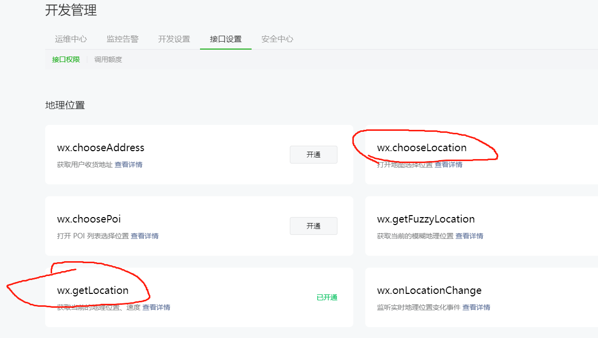
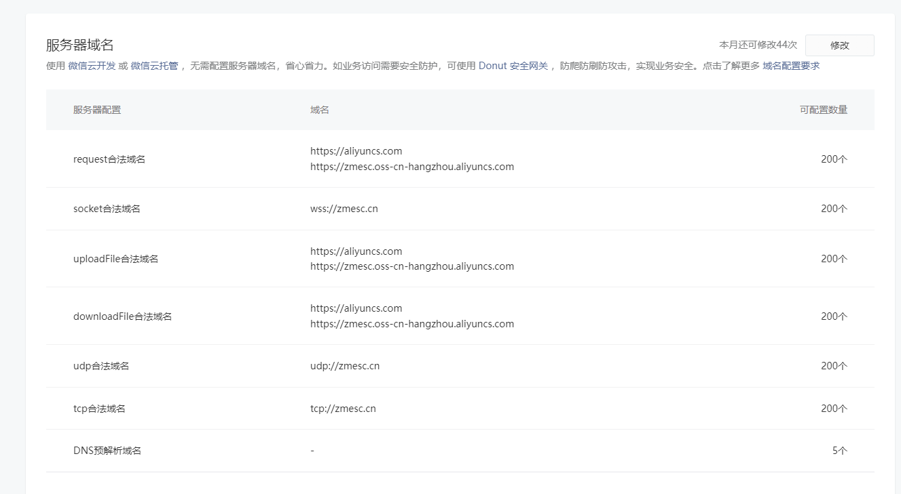
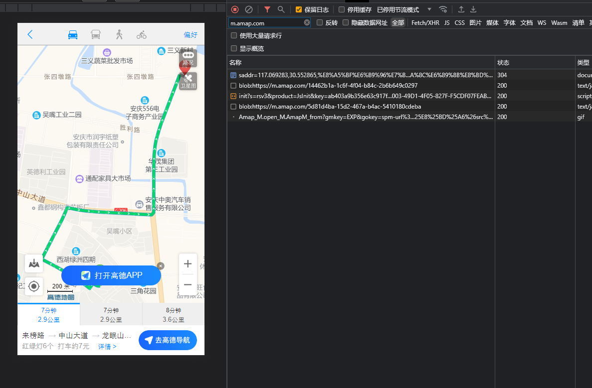
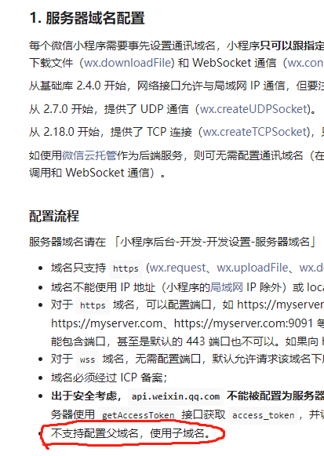

## [``uni.openLocation``](https://uniapp.dcloud.net.cn/api/location/open-location.html#openlocation)

* 先用``uni.getLocation`` 获取当前位置
* 再用``uni.openLocation`` 打开地图
* ❗️微信小程序里面，``uni.openLocation`` 会打开微信内置地图，而不是高德地图
* 👍不需要集成sdk
* 👎👎👎微信小程序需要开通这几个接口权限

## [高德地图 URI API](https://lbs.amap.com/api/uri-api/summary)

::: tip
就是高德提供了一个写好了地图页面,你只需要传入参数就可以打开这个页面
:::
* 👍不需要集成sdk
* 微信小程序里面通过``uniapp``内置的[``web-view``](https://uniapp.dcloud.net.cn/component/web-view.html#)组件来打开这个链接
* 👎👎👎👎👎👎👎👎👎如果要在微信小程序里面使用,需要在微信小程序后台配置域名白名单但是这个链接内加载了许多资源,这些资源的域名可能有好几个,微信域名又不允许只配置父域名就可以访问子域名,==所以如果要在微信里面用,你得把这个链接可能用到所有域名部找出来再添加配置上==
* 👍👍👍👍非常方便,不需要集成sdk,h5或者原生app都可以用,就tm各种小程序屁事多

## 集成sdk

*  微信小程序中可以参考这几篇文章 [1](https://blog.csdn.net/weixin_40450855/article/details/108802703) 
* [高德地图小程序sdk](https://lbs.amap.com/api/wx/summary)
* [vue3引用高德sdk报导入错误的解决办法](https://blog.csdn.net/moosilent/article/details/125118307)
