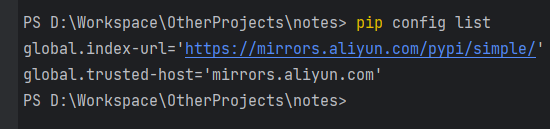

## 使用国内镜像

为了加速pip的包下载速度,可以将pip的默认镜像源修改为国内的镜像源

### windows

==1.== 打开`C:\Users\用户名\pip\pip.ini`,如果该文件不存在,则需要手动创建

==2.== 在pip.ini文件中添加以下内容:

```ini
[global]
index-url = https://mirrors.aliyun.com/pypi/simple/ 
trusted-host = mirrors.aliyun.com
```

| 参数             | 说明   |
|----------------|------|
| `index-url`    | 镜像地址 |
| `trusted-host` | 主机名  |

==3.== 用```pip config list```命令验证pip的配置是否生效,输出结果如下：



==4.== 如果需要将pip的镜像源切回官方源,只需要将pip.ini文件中的内容删除即可
