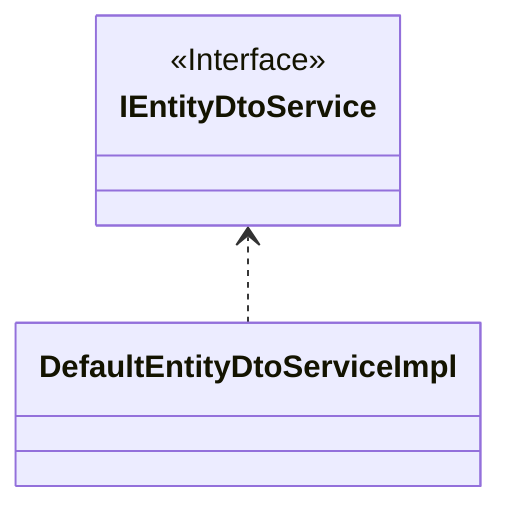

## 简介

为了避免暴露过多的细节以及`Hibernate`的`LazyInitializationException`异常,我们通常会使用`DTO`
来向客户端传递数据,这时就需要将`JPA Entity`映射成普通的`Java Bean`

## 实体映射器

`实体映射器`用于将`JPA Entity`映射成普通的`Java Bean`.

`cn.dongjak:starter-data-jpa`模块中提供了一个`DefaultEntityDtoServiceImpl`
,它用于将`持久化实体类对象`转换为`DTO对象`

:::warning
后面`IEntityDtoService`会被重构成`BeanMapper`
:::

## @Field注解

`@Field`注解用于定义字段从`持久化实体类对象`到`DTO对象`的转换规则
