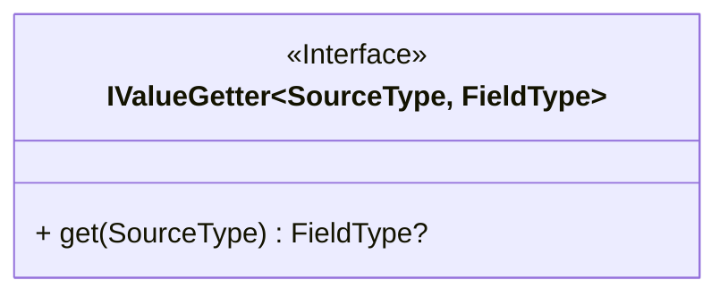

## 简介

通过实现`IValueGetter`接口,可以自定义转换逻辑,`IValueGetter`的定义如下:



## 示例

假设有源对象如下:

```kotlin
data class Source(
    val id: Long,
    val name: String,
    val age: Int,
    val birthday: LocalDate
)
```

目标对象如下:

```kotlin
data class Target(
    val id: Long,
    val details: String
)
```

现在我们需要将`Source`对象转换成`Target`对象,并且`details`字段的值为`name`和`age`的拼接,可以通过以下方式实现:

```kotlin
class SourceToTargetConverter : IValueGetter<Source, Target> {
    override fun get(source: Source): Target {
        return Target(
            id = source.id,
            details = "${source.name}(${source.age})"
        )
    }
}
```

然后在`DTO`类中使用`@Field`注解指定转换器:

```kotlin

data class Target(
    val id: Long,
    @Field(valueGetter = SourceToTargetConverter::class)
    val details: String
)

```
