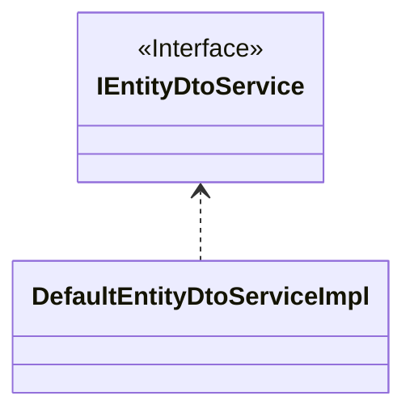

## 简介

为了避免暴露过多的细节以及`Hibernate`的`LazyInitializationException`异常,我们通常会使用`DTO`来向客户端传递数据

`cn.dongjak:starter-data-jpa`模块中提供了一个`DefaultEntityDtoServiceImpl`
,它用于将`持久化实体类对象`转换为`DTO对象`



## @Field注解

`@Field`注解用于定义字段从`持久化实体类对象`到`DTO对象`的转换规则

## 日期时间类型

### `LocalDateTime`和`LocalDate`

::::: details 实体类
```kotlin
@Entity
@Table(name = "hi_robot")
class HiRobot : AbstractPersistable<Long>() {
    @Column(name = "created_date")
    var createdDate: LocalDate? = null
}
```
:::::

1. 格式化成`yyyy-MM-dd`字符串

```kotlin
data class HiRobotAdminDto(
    @Field("createdDate?.formatted")
    val createdDate: String? = null,
)
```

2. 格式化成相对于当前时间的人性化时间

```kotlin
data class HiRobotAdminDto(
    @Field("createdDate?.humanReadable")
    val createdDate: String? = null,
)
```

最终效果为:


