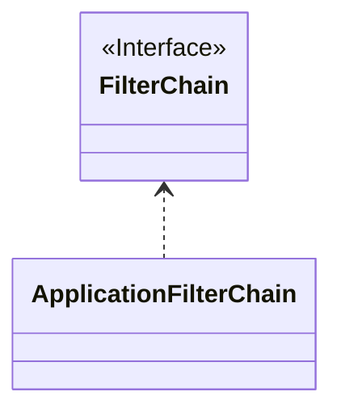
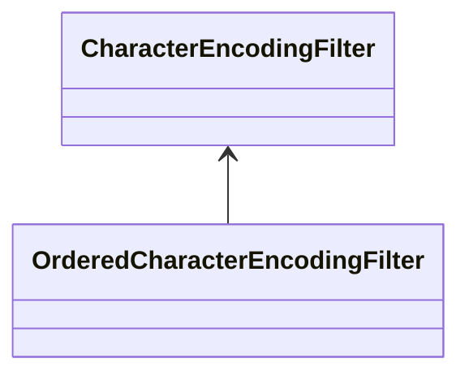

## 简介

因为`Spring Security`是基于各种各样的`Servlet`过滤器实现的,所以了解过滤器的执行顺序对于理解`Spring Security`的工作原理非常重要.

刚好我这里遇到一个过滤器不生效的问题,通过调试确认出是由于执行顺序导致的,所以这里记录一下.

## 相关配置

使用的相关配置如下:

::::: details security配置

```kotlin
@EnableWebSecurity
@Configuration
class SecurityConfig(private val context: ApplicationContext) {

    @Bean
    @ConditionalOnMissingBean
    fun jwtAuthenticationFilter(
        jwtTokenProvider: IJwtTokenProvider,
        userDetailsService: UserDetailsService
    ): JwtAuthenticationFilter {
        return JwtAuthenticationFilter(jwtTokenProvider, userDetailsService)
    }

    @Bean
    @Throws(Exception::class)
    fun filterChain(http: HttpSecurity): SecurityFilterChain {
        http.sessionManagement {
            it.sessionCreationPolicy(STATELESS)
        }
        http.authorizeHttpRequests {
            it.permitKnife4j(context)
            it.permitAuthentication()
            it.anyRequest().authenticated()
//            it.anyRequest().permitAll()
        }
        http.csrf {
            it.disable()
        }

        return http.build()
    }
}
```

:::::

::::: details jwt过滤器

```kotlin
class JwtAuthenticationFilter(private val jwtTokenProvider: IJwtTokenProvider , private val userDetailsService: UserDetailsService) :
    OncePerRequestFilter() {

    override fun doFilterInternal(
        request: HttpServletRequest,
        response: HttpServletResponse,
        filterChain: FilterChain
    ) {
        // 从 request 获取 JWT token

        val token = getTokenFromRequest(request)
        //...具体逻辑
        filterChain.doFilter(request, response)
    }
}
```

:::::

## 问题分析

在[默认配置](./默认配置.md)这里介绍过核心过滤器`FilterChainProxy`,所以我分别在`JwtAuthenticationFilter`
和`FilterChainProxy`中打了断点,然后在浏览器中访问了一个需要认证的接口,结果发现只有`FilterChainProxy`
中的断点被触发了,而`JwtAuthenticationFilter`中的断点没有被触发.

<script setup lang="ts">
const images = [{src:'https://cdn.jsdelivr.net/gh/hhypygy/images@master/20240101/image.6m210oynnm80.webp',alt:''}]
const images2 = [{src:'https://cdn.jsdelivr.net/gh/hhypygy/images@master/20240101/image.2f8q15xydou8.webp',alt:''}]
const images3 = [{src:'https://cdn.jsdelivr.net/gh/hhypygy/images@master/20240101/image.11e495u46vr4.webp',alt:''}]
const images4 = [{src:'https://cdn.jsdelivr.net/gh/hhypygy/images@master/20240101/image.44czzorcw1o0.webp',alt:''}]
const images5 = [{src:'https://cdn.jsdelivr.net/gh/hhypygy/images@master/20240101/image.2fa0434ao3b4.webp',alt:''}]
const images6 = [{src:'https://cdn.jsdelivr.net/gh/hhypygy/images@master/20240101/image.uoon1ccvhj4.webp',alt:''}]
const images7 = [{src:'https://cdn.jsdelivr.net/gh/hhypygy/images@master/20240101/image.5ctj5nv96f80.webp',alt:''}]
const images8 = [{src:'https://cdn.jsdelivr.net/gh/hhypygy/images@master/20240101/image.45zz9orsneg0.webp',alt:''}]
const images9 = [{src:'https://cdn.jsdelivr.net/gh/hhypygy/images@master/20240101/image.4i1ilnj7vh20.webp',alt:''}]
const images10 = [{src:'https://cdn.jsdelivr.net/gh/hhypygy/images@master/20240101/image.2cef31u6c05c.png',alt:''}]
const images11 = [{src:'https://cdn.jsdelivr.net/gh/hhypygy/images@master/20240101/image.1rhntkongeyo.png',alt:''}]
</script>
<ImageRenderer :value="images" width="1000" height="500" />

这里可以看到`FilterChainProxy`中压根就没有`JwtAuthenticationFilter`这个过滤器

接着再去看看`tomcat`和`spring security`交接的地方有没有这个`JwtAuthenticationFilter`
这个过滤器,这里就要提一下[`FilterChain`](https://jakarta.ee/specifications/servlet/5.0/apidocs/jakarta/servlet/filterchain)
和[`ApplicationFilterChain`](https://tomcat.apache.org/tomcat-8.5-doc/api/org/apache/catalina/core/ApplicationFilterChain.html)
这两个类了.



* `jakarta.servlet.FilterChain` - 这个接口是`servlet`
  规范中定义的,表示一个过滤器链,里面维持了一个过滤器列表,当一个请求到达`servlet`容器时,`FilterChain`
  依次调用这些过滤器来处理请求.直到最后一个过滤器处理完毕后,请求才会被转发给`servlet`或者`jsp`来处理.
* `org.apache.catalina.core.ApplicationFilterChain` - 这个类是`tomcat`中`FilterChain`的具体实现类,`Spring Security`
  中的核心类`FilterChainProxy`就是在这里面被调用的

从上面的分析可以看到,`tomcat`和`spring security`交接的地方就是`ApplicationFilterChain`这个类,如图:


<ImageRenderer :value="images2" width="1000" height="200" />

在`ApplicationFilterChain`中打断点重新发起请求后看到`JwtAuthenticationFilter`出现在`FilterChainProxy`之后:

<ImageRenderer :value="images3" width="1000" height="300" />

这里首先有个问题,为什么`JwtAuthenticationFilter`没有被`FilterChainProxy`管理而是跑到了`ApplicationFilterChain`
中,这个问题可以看`Spring Security`中的[过滤器注册机制](./过滤器注册机制.md)

到这一步没有执行`JwtAuthenticationFilter`的原因应该就比较清晰了,是因为`FilterChainProxy`
中的**其它过滤器提前对这个请求作出了响应而没有继续调用`chain.doFilter(request, response)`**
,导致`JwtAuthenticationFilter`没有机会被执行

接下来要做的就是找出`FilterChainProxy`中的哪个过滤器没有调用`chain.doFilter(request, response)`

<ImageRenderer :value="images4" width="1000" height="500" />

上面可以看到`FilterChainProxy`中一共有这么多个过滤器,这些过滤器的具体作用在[简介](./简介.md)中提到过

<ImageRenderer :value="images5" width="1000" height="200" />

这里可以看到有一个过滤器直接返回了一个`403`的响应,根据这一点,我们在`FilterChainProxy`中找出是哪一个过滤器干的

`403`响应表示没有权限,所以我们可以根据过滤器名称大概猜测一下哪些过滤器负责权限这一块的事,然后再在它们的`doFilter`
方法中打断点,这里我猜是`AuthorizationFilter`,因为它注释中写着:

    An authorization filter that restricts access to the URL using

<ImageRenderer :value="images6" width="1000" height="500" />

通过调试发现果然就是它

最后一个问题,是谁向客户端返回了`403`响应,在上面抛出异常后继续调试,层层套娃,最终套到了

<ImageRenderer :value="images7" width="1000" height="500" />

最终由`Http403ForbiddenEntryPoint`的`commence`方法向客户端写入了`403`响应

<ImageRenderer :value="images8" width="1000" height="300" />

## 问题解决

找到问题后解决起来就简单了,有两种方案:

1. 把`JwtAuthenticationFilter`交给`FilterChainProxy`管理
2. 让`JwtAuthenticationFilter`在`FilterChainProxy`之前执行

对于第一种方案参考`Spring Security`中的[过滤器注册机制](./过滤器注册机制.md)

第二种的话回到`ApplicationFilterChain`中的断点继续分析

<ImageRenderer :value="images9" width="1000" height="300" />

可以看到这里虽然`JwtAuthenticationFilter`在`FilterChainProxy`之后,但是`FilterChainProxy`
也不是第一个啊,所以随便找一个位于`FilterChainProxy`之前的过滤器,比如说`CharacterEncodingFilter`
,发现`ApplicationFilterChain`实际用到的是它的一个子类`OrderedCharacterEncodingFilter`

<ImageRenderer :value="images10" width="1000" height="200" />

这个子类实现了`OrderedFilter`接口



```java
public class OrderedCharacterEncodingFilter extends CharacterEncodingFilter implements OrderedFilter {

	private int order = Ordered.HIGHEST_PRECEDENCE;

	@Override
	public int getOrder() {
		return this.order;
	}

	/**
	 * Set the order for this filter.
	 * @param order the order to set
	 */
	public void setOrder(int order) {
		this.order = order;
	}

}
```

`OrderedFilter`接口用于对过滤器排序,参考[Spring Security过滤器排序规则](https://www.springcloud.io/post/2022-05/spring-security-filters-sorting-rules/#gsc.tab=0)

```kotlin
class JwtAuthenticationFilter(private val jwtTokenProvider: IJwtTokenProvider , private val userDetailsService: UserDetailsService) :
    OncePerRequestFilter()  , OrderedFilter{

    override fun doFilterInternal(
        request: HttpServletRequest,
        response: HttpServletResponse,
        filterChain: FilterChain
    ) {
        // 从 request 获取 JWT token

        val token = getTokenFromRequest(request)
        //...具体逻辑
        filterChain.doFilter(request, response)
    }
    
     override fun getOrder(): Int {
        return Ordered.HIGHEST_PRECEDENCE
    }
}
```

现在我把`JwtAuthenticationFilter`实现了`OrderedFilter`接口,并且设置了最高优先级,再次发起请求,可以看到它现在已经在`FilterChainProxy`之前了

<ImageRenderer :value="images11" width="1000" height="300" />
