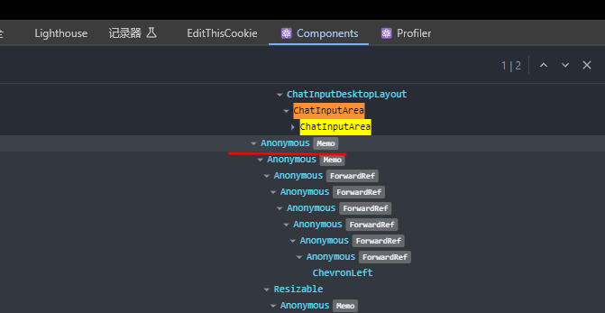

## 组件名显示成`Anonymous`

如图:



解决办法是指定`displayName`这个静态属性,例如:

```tsx
import { ChatInputArea } from '@lobehub/ui';
ChatInputArea.displayName="ChatInputArea"
```
## 参考

* [ReactJS 疑难排解：使用react-devtools - iT 邦帮忙::一起帮忙解决难题，拯救IT 人的一天](https://ithelp.ithome.com.tw/articles/10237501)
