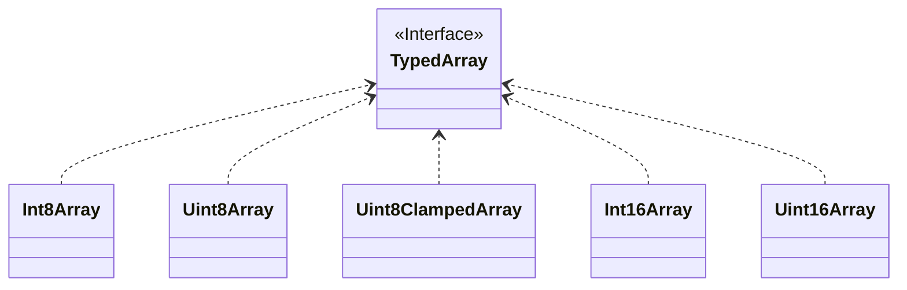
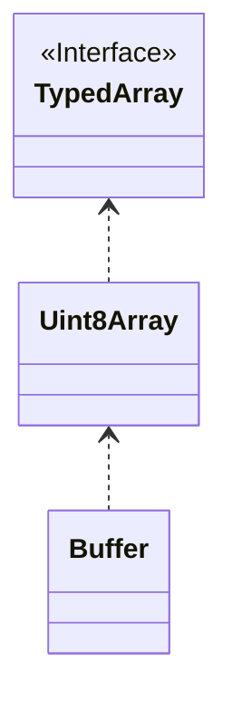

## Web环境

### 上传

在`html`中使用`<input type="file" />`
来上传文件,用户选择的文件会被存储在[FileList](https://developer.mozilla.org/zh-CN/docs/Web/API/FileList)对象中

[FileList](https://developer.mozilla.org/zh-CN/docs/Web/API/FileList)类似于数组,但没有数组的`push`、`pop`或`slice`等方法(
可以用`Array.from(fileList)`将其转换成数组).

[FileList](https://developer.mozilla.org/zh-CN/docs/Web/API/FileList)
中的每一项都是一个[File](https://developer.mozilla.org/zh-CN/docs/Web/API/File)对象,包含了文件的一些基本信息,比如文件名、大小、类型等.

::: sandpack#react-ts React 示例 [  theme=dark]

@file /App.tsx

```tsx 
import {useEffect, memo, useState, useRef, ChangeEvent} from "react";

export default () => {
    const [files, setFiles] = useState([])

    const onFileChange = (event: ChangeEvent<HTMLInputElement>) => {
        const fileList: FileList = event.target.files;
        const newFiles = Array.from(fileList).map(file => ({
            name: file.name,
            size: file.size,
            type: file.type,
            lastModified: file.lastModified,
        }));
        setFiles(newFiles);
    }
    return <div>
        <input type="file" onChange={onFileChange} multiple/>
        <ul>
            {files.map((file, index) => <li key={index}>{file.name}</li>)}
        </ul>
    </div>;
}
```

@setup

```js
{
    dependencies: {
    }
}
```

:::

接下来可以使用`form`、`fetch`和`axios`等方式将文件上传到服务器

上传过程中使用[FormData](https://developer.mozilla.org/zh-CN/docs/Web/API/FormData)携带包含文件的表单数据.

1. ==使用form==

```html

<form action="/upload" method="post" enctype="multipart/form-data">
    <input type="file" name="file"/>
    <input type="submit" value="Upload File"/>
</form>
```

2. ==使用[Fetch API](https://developer.mozilla.org/zh-CN/docs/Web/API/Fetch_API)==

```ts
// 添加文件到FormData对象
const formData = new FormData();
const fileList: FileList = event.target.files;
for (let i = 0; i < fileList.length; i++) {
    formData.append(`file[${i}]`, files[i]);
}

// 发送请求
const response = await fetch('/upload', {
    method: 'POST',
    body: formData,
});
```

3. ==使用[Axios](https://www.npmjs.com/package/axios)==

```ts

// 同样先创建一个FormData对象
const formData = new FormData();
const fileList: FileList = event.target.files;
for (let i = 0; i < fileList.length; i++) {
    formData.append(`file[${i}]`, files[i]);
}

// 然后发送请求
const response = await axios.post('/upload', formData, {
    headers: {
        'Content-Type': 'multipart/form-data',
    },
});
```

### 存储

有时候用户选择的文件不会立即上传到服务器,而是需要在先本地存储一段时间,这时候可以考虑以下几种方式:

#### 现代前端框架中跨组件存储

在`React`或者`Vue`等前端框架中,可以将文件存储在全局状态库中,比如说`pinia`或者`zustand`.

**但是,由于[File](https://developer.mozilla.org/zh-CN/docs/Web/API/File)
对象是非序列化的,这可能会导致一些调试工具无法正确显示状态,且可能会阻碍状态的持久化.**

因此,推荐只存储文件的元数据而不是[File](https://developer.mozilla.org/zh-CN/docs/Web/API/File)对象本身.

#### 使用IndexedDB

如果需要处理大量文件或大文件,并且希望在用户的会话之间持久存储,可以使用[IndexedDB](https://developer.mozilla.org/zh-CN/docs/Web/API/IndexedDB_API)

[IndexedDB](https://developer.mozilla.org/zh-CN/docs/Web/API/IndexedDB_API)是一个在浏览器中运行的低级API,适用于存储大量数据,包括文件.

下面这个例子展示了如何通过将文件存储在[IndexedDB](https://developer.mozilla.org/zh-CN/docs/Web/API/IndexedDB_API)
中从而实现持久化或者跨组件存储:

```ts
uploadFile: async (file: File) => {
    const data = await fileService.uploadFile({
        createdAt: file.lastModified,
        data: await file.arrayBuffer(),
        fileType: file.type,
        name: file.name,
        saveMode: 'local',
        size: file.size,
    });
}
```

上面的`fileService.uploadFile`
方法会将文件存储到[IndexedDB](https://developer.mozilla.org/zh-CN/docs/Web/API/IndexedDB_API)中,`File.arrayBuffer()`
用于获取文件的二进制数据,它用一个[ArrayBuffer](https://developer.mozilla.org/zh-CN/docs/Web/JavaScript/Reference/Global_Objects/ArrayBuffer)
表示

然后在需要上传的时候再从[IndexedDB](https://developer.mozilla.org/zh-CN/docs/Web/API/IndexedDB_API)中读出来上传:

```ts

//从IndexedDB中读取文件并创建FormData
const file = await fileService.getFile(fileId);
const blob = new Blob([file.data], {type: item.fileType});
const formData = new FormData();
formData.append('file', blob, 'filename.bin');

//发送请求上传文件
const response = await axios.post('/upload', formData, {
    headers: {
        'Content-Type': 'multipart/form-data',
    },
});
```

### 预览

为了提高用户体验,有时候需要在用户选择文件后立即预览文件,比如说[图片](https://developer.mozilla.org/zh-CN/docs/Web/HTML/Element/img)、[视频](https://developer.mozilla.org/zh-CN/docs/Web/HTML/Element/video)、[音频](https://developer.mozilla.org/zh-CN/docs/Web/HTML/Element/audio)
等.

但是此时我们只有[File](https://developer.mozilla.org/zh-CN/docs/Web/API/File)对象,而没有``、`<audio>`、`<video`
这几个标签所需要的`url`

这时就可以用到[URL.createObjectURL](https://developer.mozilla.org/zh-CN/docs/Web/API/URL/createObjectURL)
方法,它会创建一个指向该[File](https://developer.mozilla.org/zh-CN/docs/Web/API/File)对象的`URL`.

```ts
const file = await fileService.getFile(fileId);
const blob = new Blob([file.data], file.fileType);
const url = URL.createObjectURL(blob);
```

再将``指向这个`url`即可:

```html

```

::: sandpack#react-ts React 示例 [  theme=dark]

@file /App.tsx

```tsx 
import {useEffect, memo, useState, useRef, ChangeEvent} from "react";

export default () => {
    const [files, setFiles] = useState([])

    const onFileChange = (event: ChangeEvent<HTMLInputElement>) => {
        const fileList: FileList = event.target.files;
        const newFiles = Array.from(fileList).map(file => ({
            name: file.name,
            size: file.size,
            type: file.type,
            lastModified: file.lastModified,
            url: URL.createObjectURL(file)
        }));
        setFiles(newFiles);
    }
    const style = {
        display: 'flex',
        flexWrap: 'wrap',
        gap: '10px',
        marginTop: '10px'
    }
    return <div>
        <input type="file" onChange={onFileChange} multiple/>
        <div style={style}>
            {files.map((file, index) => )}
        </div>

    </div>;
}
```

@setup

```js
{
    dependencies: {
    }
}
```

:::

## Node环境

在`Node`环境中,可以使用[fs](https://nodejs.org/api/fs.html)模块来处理文件,它提供了一些方法来读取、写入、删除文件等.

### 读取文件

1. 异步读取(文本类型)

```ts
import * as fs from "fs";

fs.readFile('/path/to/your/file.txt', 'utf8', (err, data) => {
    if (err) {
        console.error('Error reading the file:', err);
        return;
    }
    console.log(data);
});
```

2. 同步读取(文本类型)

```ts
import * as fs from "fs";

try {
    const data = fs.readFileSync('/path/to/your/file.txt', 'utf8');
    console.log(data);
} catch (err) {
    console.error('Error reading the file:', err);
}
```

3. 异步读取(二进制类型)

:::tip
读取二进制数据时,不要给`readFile`或者`readFileSync`
方法指定编码格式,这时就会返回一个[Buffer](https://nodejs.org/api/buffer.html#buffer)对象
:::

```ts
import * as fs from "fs";

fs.readFile('/path/to/your/file.txt', (err, data) => {
    if (err) {
        console.error('Error reading the file:', err);
        return;
    }
    console.log(data);
});
```

4. 使用[Stream Api](https://nodejs.org/api/stream.html)处理大文件

```ts
import * as fs from "fs";

const readStream = fs.createReadStream('/path/to/your/largefile.txt', 'utf8');

readStream.on('data', (chunk) => {
    console.log('New chunk received:');
    console.log(chunk);
});

readStream.on('error', (err) => {
    console.error('Error reading the file:', err);
});

readStream.on('end', () => {
    console.log('Read stream finished.');
});
```

## 二进制数据相关API

1. [ArrayBuffer](https://developer.mozilla.org/zh-CN/docs/Web/JavaScript/Reference/Global_Objects/ArrayBuffer)

`js`内置对象,用于表示通用的、固定长度的原始二进制数据缓冲区.类似`java`里面的`byte[]`

[ArrayBuffer](https://developer.mozilla.org/zh-CN/docs/Web/JavaScript/Reference/Global_Objects/ArrayBuffer)
本身并不提供任何直接的机制去读写其中的内容,而是要用到[TypedArray](https://developer.mozilla.org/zh-CN/docs/Web/JavaScript/Reference/Global_Objects/TypedArray)
或者[DataView](https://developer.mozilla.org/zh-CN/docs/Web/JavaScript/Reference/Global_Objects/DataView)

2. [TypedArray](https://developer.mozilla.org/zh-CN/docs/Web/JavaScript/Reference/Global_Objects/TypedArray)

`TypedArray`不是一个具体的类型,它是`es6`中引入的用于读写`ArrayBuffer`中的数据的一系列类型数组的别名,包括以下类型:

```ts
type TypedArray =
    | Uint8Array
    | Uint8ClampedArray
    | Uint16Array
    | Uint32Array
    | Int8Array
    | Int16Array
    | Int32Array
    | BigUint64Array
    | BigInt64Array
    | Float32Array
    | Float64Array;
```

可以简单的理解成:



3. [Buffer](https://nodejs.org/api/buffer.html#buffer)

只能在`Node`环境中使用,用于处理二进制数据,继承自`js`的[Uint8Array](https://developer.mozilla.org/en-US/docs/Web/JavaScript/Reference/Global_Objects/Uint8Array)



4. [Blob](https://developer.mozilla.org/zh-CN/docs/Web/API/Blob)

`Web Api`中定义的对象,表示不可变的类似文件对象的原始数据,通常用于文件上传、下载、网络请求、数据存储及音视频处理等场景.
