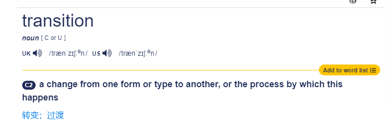

## 简介
 [``transition``](https://developer.mozilla.org/en-US/docs/Web/CSS/transition)是CSS3中的一个属性,用于定义==元素在状态改变时的过渡效果==

:::tip
英语里面``transition``是一个名词,中文意思是过渡、转变,就是``从一种形式或类型到另一种形式或类型的变化，或者这种变化的过程``

:::

:::tip
在讨论这个css属性的时候我们认为``transition``是**过程属性**,除此之外的就叫**目的属性**,这样就可以把这个属性理解为是==用来向用户展示达到某个目的的过程的==
:::

:::tip
单词上看``transition``和[transform](transform.md)长得有点像,但其实它俩的作用完全不一样,``transform``是为了达到**变形**的目的,但是除了把一个元素变形外,还可能有许多其它的目的,比如说
调整元素的位置、改变元素的颜色等等,这些目的的实现过程都可以通过``transition``属性来向用户展示,整个实现过程是一条线,它是有时间概念的,所以这是个正儿八经的动画属性
:::


## 语法
```css

.test{
    /* 当你调整元素的 margin-right,在4秒内展示这个变化过程*/
    transition: margin-right 4s;

    /* 当你调整元素的 margin-right,在4秒内展示这个变化过程,但在1秒的延迟后再开始展示*/
    transition: margin-right 4s 1s;

    /* 当你调整元素的 margin-right,在4秒内展示这个变化过程,再用ease-in-out这个时间函数细化变化过程中某个时间段的速度*/
    transition: margin-right 4s ease-in-out;

    
    /* 应用于多个属性的情况 */
    transition:
            margin-right 4s,
            color 1s;
}
```

:::tip 时间函数
[``时间函数(timing-function)``](https://developer.mozilla.org/en-US/docs/Web/CSS/transition-timing-function?locale=en)用于控制元素在状态改变时的过渡速度

常见的有:

* ``ease-in-out`` - 开始和结束时速度较慢,中间时速度较快
* ``ease-in`` - 开始时速度较慢,结束时速度较快
* ``ease-out`` - 开始时速度较快,结束时速度较慢
* ``linear`` - 匀速
* ``cubic-bezier`` - 自定义速度曲线
:::

## 示例

:::normal-demo 过渡效果演示
```html
<h1>CSS Transition 效果</h1>
<label for="animationSelect">选择动画效果：</label>
<select id="animationSelect">
    <option selected  >请选择动画效果</option>
    <option value="widthAndColor">宽度增加 & 背景色变化</option>
    <option value="fadeOut">淡出</option>
    <option value="scale">放大</option>
    <option value="rotate">旋转</option>
    <option value="translate">平移</option>
    <option value="skew">倾斜</option>
</select>
<div class="comparison">
    <div class="box">
        <label>动画前</label>
        <div class="original"></div>
    </div>
    <div id="animationBox" class="box"  >
        <label id="animationLabel">动画效果</label>
        <div id="animated" class="original"></div>
    </div>
</div>
```
```css
.comparison {
    display: flex;
    justify-content: space-around;
}

.box label {
    display: block;
    text-align: center;
}

.original, #animated {
    width: 100px;
    height: 100px;
    margin: 50px auto;
    background-color: #008000;
    opacity: 1;
}

#animated {
    transition: width 2s, background-color 2s, opacity 2s, transform 2s;
}
```
```js
document.getElementById('animationSelect').addEventListener('change', function() {
    var animatedElement = document.getElementById('animated');
    var selectedAnimation = this.value;

    // 还原动画效果
    animatedElement.style.width = '100px';
    animatedElement.style.backgroundColor = '#008000';
    animatedElement.style.opacity = '1';
    animatedElement.style.transform = 'none';
    document.getElementById('animationLabel').innerText = '动画效果';

    if (selectedAnimation === 'widthAndColor') {
        animatedElement.style.width = '200px';
        animatedElement.style.backgroundColor = '#ff6347';
        document.getElementById('animationLabel').innerText = '动画效果：宽度增加到 200px，背景色变为红色';
    } else if (selectedAnimation === 'fadeOut') {
        animatedElement.style.opacity = '0';
        document.getElementById('animationLabel').innerText = '动画效果：淡出效果，透明度从 1 变为 0';
    } else if (selectedAnimation === 'scale') {
        animatedElement.style.transform = 'scale(1.5)';
        document.getElementById('animationLabel').innerText = '动画效果：放大到 1.5 倍';
    } else if (selectedAnimation === 'rotate') {
        animatedElement.style.transform = 'rotate(45deg)';
        document.getElementById('animationLabel').innerText = '动画效果：旋转 45 度';
    } else if (selectedAnimation === 'translate') {
        animatedElement.style.transform = 'translate(50px, 50px)';
        document.getElementById('animationLabel').innerText = '动画效果：向右和向下各移动 50px';
    } else if (selectedAnimation === 'skew') {
        animatedElement.style.transform = 'skew(20deg, 20deg)';
        document.getElementById('animationLabel').innerText = '动画效果：沿 X 轴和 Y 轴各倾斜 20 度';
    }
});
```
