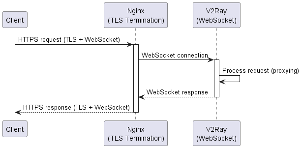

## 准备工作

1. 一台境外`vps`
2. 一个域名,并解析一个`A`记录到`vps`的`ip`

## 使用`docker`一键部署

使用[这个镜像](https://github.com/anerg2046/Caddy_V2ray),命令行是:

```bash
docker run -d  -p 80:80   -p 443:443 --name=caddy_v2ray --restart=always  \
-v /app/v2ray/.v2ray:/etc/v2ray:rw   \
-v /app/v2ray/.caddy:/etc/caddy:rw   \
-v /app/v2ray/.certificates:/data/caddy/certificates:rw  \   
-e DOMAIN=v2ray.cruldra.com   \ #这里换成你自己的域名
-e EMAIL=cruldra@gmail.com     \    # 这里换成你自己的邮箱,canndy去申请证书的时候会用到
anerg/v2ray:latest
```

这种方式会占用`80`和`443`端口,适合`vps`仅用作`v2ray`的情况,如果你的`vps`上还有其他`web`服务,则需要[手动安装](#手动安装)

:::tip
如果既想要一键部署的便利,又想部署其它网站,可以复用上面这个镜像自带的[`cadddy`](https://caddyserver.com/)服务器
:::

```bash
# 先停止并删除上面的容器
docker stop caddy_v2ray && docker rm caddy_v2ray 

# 然后把其它的网站文件映射到容器中
docker run -d  -p 80:80   -p 443:443 --name=caddy_v2ray --restart=always  \
-v /app/v2ray/.v2ray:/etc/v2ray:rw   \
-v /app/v2ray/.caddy:/etc/caddy:rw   \
-v /你的网站根目录:/var/www/网站名称 \
-v /app/v2ray/.certificates:/data/caddy/certificates:rw  \   
-e DOMAIN=v2ray.cruldra.com   \ #这里换成你自己的域名
-e EMAIL=cruldra@gmail.com     \    # 这里换成你自己的邮箱,canndy去申请证书的时候会用到
anerg/v2ray:latest
```

再编辑`.caddy`目录下的`Caddyfile`文件,添加你的网站配置,比如:

```bash
chat.cruldra.com {
  file_server {
		root /var/www/你的网站的名称
	}
	tls cruldra@gmail.com

	reverse_proxy /aaa/ 172.17.0.1:3210 {
		header_up X-Forwarded-For {remote_host}
	}
}

```

最后再进入容器命令行,重启`caddy`服务即可:

```bash
docker exec -it caddy_v2ray sh -c 'cd /etc/caddy && caddy reload'
```

## 手动安装

具体步骤参考[这篇文章](https://codefuturesql.top/post/vps/)

这里面涉及到的几个组件及其作用:
1. `客户端` - 比如[`clash`](https://github.com/lantongxue/clash_for_windows_pkg/releases/tag/0.20.39),使用[`WebSocket`](https://www.liaoxuefeng.com/wiki/1022910821149312/1103303693824096)+[`tls`](https://www.cloudflare.com/zh-cn/learning/ssl/transport-layer-security-tls/)伪装成一个普通的`https`请求,然后发送给`nginx`
2. `nginx` - 把收到的用户请求用`websocket`请求转发给本机上的`v2ray`服务
3. [**v2ray**](https://github.com/v2fly/v2ray-core) - [`VMess`](https://www.v2ray.com/chapter_02/protocols/vmess.html)协议的实现,用于流量转发

下面这张图可以帮助你理解这几个组件的关系:


